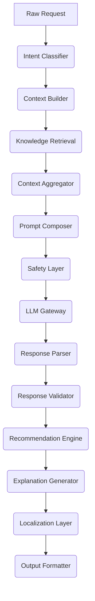
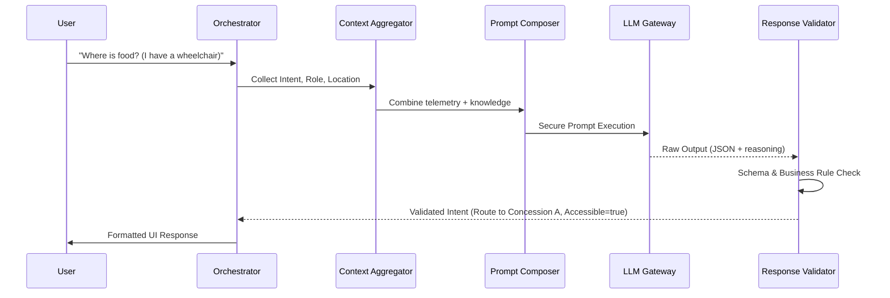
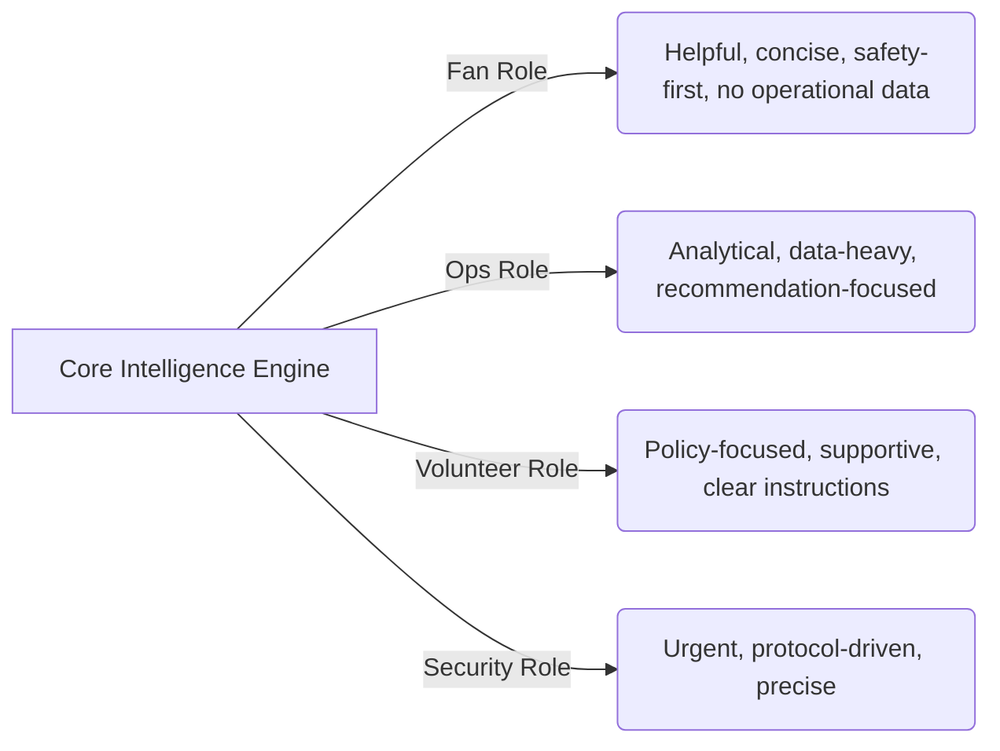
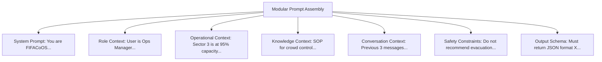
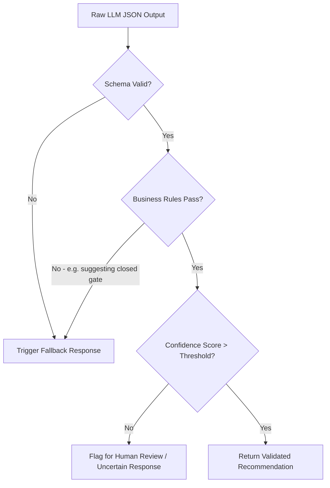

# FIFACoOS - AI Architecture Document

## 1. Document Information
- **Version:** 1.0 (Initial Draft)
- **Status:** Approved for Component Design
- **Author:** Principal AI Architecture Team
- **Last Updated:** 2026-07-08

## 2. Purpose
This document defines the comprehensive architecture of the Artificial Intelligence subsystem for FIFACoOS. It explains how intelligence is orchestrated, validated, secured, and presented. It serves as the blueprint for building the Unified Intelligence Engine (UIE) described in the System Design, ensuring the AI behaves as an enterprise-grade Operational Intelligence Engine rather than a generic conversational chatbot.

## 3. Relationship to Previous Documents
- **PRD:** Dictates the AI's role (decision support, multilingual, accessible) and constraints (MVP scope, simulated data).
- **ARCHITECTURE.md:** Establishes the AI as a decoupled, isolated subsystem.
- **SYSTEM_DESIGN.md:** Outlines how the Service Orchestrator interacts with the UIE.
- *This document* deeply explores the internal workings of the UIE.

## 4. AI Design Principles
- **Augmentation Over Automation:** AI must empower human decision-making, never replace human authority.
- **Explainability:** AI recommendations must clearly state the reasoning behind them based on ingested context.
- **Strict Boundary Enforcement:** The AI must only process data explicitly provided by the orchestrator. It cannot independently "browse" or "query" the database.
- **Fail-Safe Operation:** If the AI fails, hallucinate, or times out, the system must degrade gracefully to deterministic logic.
- **Persona-Centric Processing:** AI behavior, tone, and data access change based on the active user role.

## 5. AI System Overview
The FIFACoOS AI Subsystem (Unified Intelligence Engine) is a specialized processing pipeline designed to ingest natural language, marry it with real-time stadium telemetry and static operational policies, and output highly structured, validated operational recommendations and assistance. 

## 6. AI Responsibilities

### What AI SHOULD Do
- **Operational Reasoning:** Synthesize multiple conflicting data points (e.g., three separate incident reports about the same event) into a coherent summary.
- **Contextual Recommendations:** Suggest staff deployments based on crowd density.
- **Multilingual Assistance:** Interpret and respond to queries in EN, ES, FR, and HI.
- **Navigation Guidance Interpretation:** Map a complex human query ("I have a stroller, where's the closest food?") to deterministic routing intents.
- **Knowledge Synthesis:** Retrieve and summarize Standard Operating Procedures (SOPs) for Volunteers and Security.

### What AI SHOULD NOT Do
- **Execute Operational Actions:** The AI cannot dispatch police, lock gates, or issue evacuation orders automatically.
- **Generate Navigation Paths:** The AI does not calculate the shortest path. It maps the intent; deterministic algorithms calculate the graph route.
- **Manage Authentication/Authorization:** The AI does not decide who is allowed to view data.
- **Direct Database Access:** The AI cannot write to or read from the State Store directly.

## 7. AI Component Architecture

- **Intent Classifier:** 
  - *Purpose:* Determines the primary goal of the user's query (e.g., `navigate`, `summarize_incident`, `policy_lookup`).
  - *Inputs:* User query.
  - *Outputs:* Intent Enum.
- **Context Builder:** 
  - *Purpose:* Gathers role, location, and session data.
- **Context Aggregator:** 
  - *Purpose:* Merges static knowledge, dynamic telemetry, and temporary context.
- **Knowledge Retrieval:** 
  - *Purpose:* Fetches relevant static SOPs/policies based on the intent.
- **Prompt Composer:** 
  - *Purpose:* Assembles the final LLM prompt using a modular template strategy.
- **Safety Layer:** 
  - *Purpose:* Scans the prompt for injection attacks or PII before sending.
- **LLM Gateway:** 
  - *Purpose:* Manages network calls to the external LLM provider, handling retries and timeouts.
- **Response Parser:** 
  - *Purpose:* Extracts JSON blocks from the raw LLM string output.
- **Response Validator:** 
  - *Purpose:* Validates the parsed JSON against strict schemas (e.g., Zod).
  - *Failure Mode:* If schema fails, triggers a deterministic fallback.
- **Recommendation Engine:** 
  - *Purpose:* Maps validated AI intents to actionable UI elements for Ops staff.
- **Explanation Generator:** 
  - *Purpose:* Ensures every recommendation is accompanied by a "Why" statement.
- **Localization Layer:** 
  - *Purpose:* Ensures the output matches the user's requested locale.
- **Output Formatter:** 
  - *Purpose:* Packages the final response for the API Gateway.

## 8. AI Request Lifecycle

## 9. Persona-Aware AI

The AI engine remains shared, but behavior changes based on injected System Prompts tied to the user's RBAC role. Fans never receive security context, preventing unauthorized advice.

## 10. Context Engineering
Context is rigorously structured before hitting the LLM.
- **Static Context:** Venue maps, baseline SOPs, language dictionaries. (Changes rarely).
- **Dynamic Context:** Live telemetry, crowd density, queue times, active incident reports. (Changes constantly).
- **Temporary Context:** The current conversation history, user location in the stadium. (Lasts for the session).
- **Persistent Context:** User role, accessibility preferences (e.g., "requires wheelchair routing").

## 11. Prompt Engineering Strategy

*Why modular?* Modular prompts allow the system to dynamically inject only the necessary context, keeping prompt size manageable, reducing latency, and strictly partitioning data (e.g., the "Operational Context" module is simply excluded for Fan requests).

## 12. Deterministic vs AI Responsibilities
- **Deterministic (Non-AI):** Navigation algorithms (A* routing), RBAC permission checks, database queries, mathematical aggregations of crowd size, rendering the UI.
- **AI Responsibilities:** Synthesizing the 5 separate text reports of an incident into a single paragraph, translating user slang into a structured routing intent, recommending a staff redeployment strategy based on textual SOPs.

## 13. Safety Architecture
- **Hallucinations:** Prevented by the *Response Validator*. If the AI invents a Gate ("Gate Z") that isn't in the enum of valid gates provided in the schema, the response is rejected.
- **Prompt Injection:** Prevented by the *Safety Layer* which sanitizes inputs and uses strict system boundary delimiters.
- **Sensitive Data Exposure:** Prevented by the *Context Builder*, which physically cannot access security data if the IAM role is "Fan".
- **Unauthorized Operational Advice:** The System Prompt strictly forbids the LLM from making final decisions (e.g., "You must present this as a recommendation for human review").

## 14. Confidence & Validation

The LLM is prompted to include a self-assessed `confidence_score` in its JSON output. If the score is low, or if deterministic validation fails, the system safely falls back.

## 15. Multilingual Architecture
- The MVP supports EN, ES, FR, and HI.
- **Localization vs Translation:** UI elements are deterministically localized via standard i18n JSON files. The AI is used purely for *translating conversational input and generating natural language explanations* in the target language.
- **Consistency:** Core entity names (e.g., "Medical Tent B", "Gate 4") are enforced in the prompt to remain consistent and not literally translated.

## 16. Failure Handling
- **LLM Unavailable / Timeout:** The Service Orchestrator catches the timeout and returns a predefined deterministic response (e.g., "I am experiencing delays. Please follow digital signage or ask a nearby Volunteer.").
- **Invalid Outputs:** If the schema validation loop fails twice, the system aborts the AI flow and triggers a graceful degradation.
- **Partial Context:** If telemetry is missing, the AI is prompted to acknowledge the missing data ("I cannot see current wait times, but the nearest food is...").

## 17. Future AI Evolution (Post-MVP)
- **RAG (Retrieval-Augmented Generation):** Enhancing the MVP's static policy lookups with vector databases for querying massive historical event manuals.
- **Computer Vision:** Ingesting live CCTV feeds as multimodal context for crowd density AI analysis.
- **Predictive Analytics:** Moving from real-time recommendations to predictive forecasting (e.g., "Sector 4 will be congested in 15 minutes").

## 18. AI Design Trade-offs
- **Trade-off:** Centralized UIE vs Distributed Agents.
  - *Chosen:* Centralized UIE.
  - *Benefits:* Simpler to secure, easier to trace context, fits MVP timeline.
  - *Limitations:* Less autonomous; cannot easily have AI "agents" negotiate with each other.
- **Trade-off:** Strict JSON Output vs Streaming Text.
  - *Chosen:* Hybrid (JSON for intents/actions, text for explanation).
  - *Benefits:* Guarantees UI can render deterministic widgets based on JSON, while still feeling conversational.
  - *Limitations:* Harder to stream JSON arrays reliably to the client without buffering.

## 19. Consistency Review
- **PRD:** Confirmed. The AI acts exclusively as a decision-support copilot. Anonymous fan access is enforced via strict context boundaries.
- **ARCHITECTURE.md:** Confirmed. The UIE remains an isolated, stateless subsystem.
- **SYSTEM_DESIGN.md:** Confirmed. The UIE interacts exclusively with the Service Orchestrator and does not reach into databases directly.

---

## Executive Summary
This document defines the comprehensive architecture for the FIFACoOS AI subsystem, the Unified Intelligence Engine (UIE). 

**Purpose:** To establish a robust, fail-safe AI pipeline that augments operational decision-making and fan experiences without introducing unpredictable or unsafe behavior.

**Major AI Design Decisions:**
1. **Modular Prompting & Strict Validation:** The AI operates on dynamically constructed prompts injected with curated telemetry. All outputs are forced into JSON schemas and strictly validated before reaching the user.
2. **Persona-Aware Execution:** A single intelligence engine adapts its tone, constraints, and data access based entirely on the authenticated user role (or lack thereof for fans).
3. **Deterministic Separation:** The AI is strictly barred from routing algorithms or executing actions. It serves to map intents and synthesize unstructured data.

**Dependencies:**
- This design relies entirely on the boundaries established in `ARCHITECTURE.md` and `SYSTEM_DESIGN.md`. 
- Future documents (e.g., specific Prompt Templates, API definitions for the LLM Gateway) will depend directly on this design.

**Deferred Decisions:**
- Specific LLM foundational model selection (e.g., Gemini 1.5 Pro vs. GPT-4).
- Exact JSON schemas for the `Response Validator`.
- Frameworks for the LLM Gateway (e.g., LangChain, LlamaIndex, or custom implementation).
