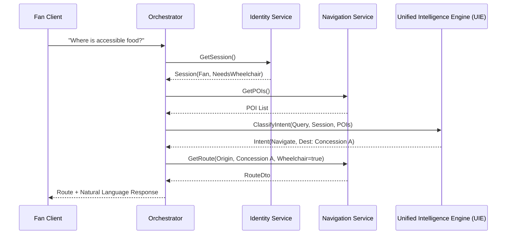

# FIFACoOS - Logical API Design

## 1. Document Information
- **Version:** 1.0
- **Status:** Approved (Frozen)
- **Author:** Principal Software Architecture Team
- **Last Updated:** Architecture Synchronization Review
- **Depends On:** SYSTEM_DESIGN.md, DATABASE_SCHEMA.md
- **Supersedes:** None

## 2. Purpose
This document defines the logical service contracts and API architecture for FIFACoOS. It establishes the communication boundaries, input/output structures, and interaction lifecycles between the system's modular subsystems. This document remains strictly technology-neutral, focusing on business capabilities rather than implementation specifics like HTTP endpoints, GraphQL schemas, or REST controllers.

## 3. Relationship to Previous Documents
- **SYSTEM_DESIGN.md:** Outlines the high-level components (API Gateway, Orchestrator, Domain Services). This document defines the exact contracts passing between them.
- **DATABASE_SCHEMA.md:** Defines the physical data structures. This document defines the higher-level domain transfer objects that abstract those physical structures.
- **AI_ARCHITECTURE.md:** Describes AI behavior. This document codifies how other services interact with the AI subsystem (UIE) via strict payload contracts.

## 4. API Design Principles
- **Business Capability-Oriented:** APIs expose actions (e.g., "Report Incident", "Request Route") rather than CRUD operations (e.g., "Insert Row").
- **Persona-Aware:** Contracts adapt based on the user's role, stripping sensitive data from responses bound for Fan clients.
- **AI-Isolated:** Interactions with the Unified Intelligence Engine (UIE) are strictly segregated and mediated by the Orchestrator.
- **Predictable & Idempotent:** State-mutating operations must be designed idempotently where possible, especially given mobile network unreliability in massive crowds.
- **Gracefully Degradable:** Service contracts must support partial success (e.g., returning a route even if the AI summary fails).

## 5. Communication Philosophy
- **Internal Service Communication:** Synchronous, strongly-typed logical function calls between the Orchestrator and Domain Services to minimize latency and architectural complexity for the MVP.
- **Client Communication:** Polling for real-time updates (as defined in SYSTEM_DESIGN.md). Synchronous request/response for actions.
- **AI Communication:** The Unified Intelligence Engine (UIE) is treated as a pure function: `Decision = F(Query, Context)`. It holds no state and cannot invoke other services.
- **Why Separate Contracts from Implementation?** Decoupling logical contracts allows the team to later choose the best protocol (REST, tRPC, gRPC, or Server Actions) without changing the business semantics.

## 6. Service Catalog
The following logical services emerge from the bounded contexts of the Domain Model:

1. **Identity & Session Service:** Manages user roles and anonymous sessions.
2. **Operations Service:** Manages incidents, assignments, and telemetry state.
3. **Navigation Service:** Manages spatial routing and POI lookups.
4. **Knowledge Service:** Manages static SOPs, policies, and FAQs.
5. **Unified Intelligence Engine (UIE):** Manages intent classification and LLM recommendations.
6. **Orchestrator Service:** Mediates cross-domain requests (The API Gateway / BFF).

## 7. Service Contracts

### 7.1 Identity & Session Service
- **Purpose:** Issue and validate user identities and ephemeral sessions.
- **Consumers:** Orchestrator.
- **Inputs:** `CreateSessionRequest(deviceFingerprint, language)`, `ValidateTokenRequest(jwt)`.
- **Outputs:** `SessionContext(userId, role, sessionId, language, accessibilityProfile)`.
- **Failure Modes:** `InvalidToken`, `SessionExpired`.
- **Authorization:** Public for session creation; internal for validation.

### 7.2 Operations Service
- **Purpose:** Manage the live stadium reality.
- **Consumers:** Orchestrator.
- **Inputs:** `ReportIncidentRequest(zone, type, severity)`, `GetZoneStateRequest(zoneId)`, `GetActiveIncidentsRequest(filters)`, `GetDashboardStateRequest()`.
- **Outputs:** `IncidentDto`, `ZoneStateDto(crowdDensity, activeIncidents)`.
- **Failure Modes:** `InvalidZone`, `UnauthorizedModification`.
- **Authorization:** Read/Write strictly limited to Ops Staff/Security.
- **Idempotency:** `ReportIncidentRequest` must include an idempotency key to prevent double-reporting from mobile devices.

### 7.3 Navigation Service
- **Purpose:** Calculate deterministic paths.
- **Consumers:** Orchestrator.
- **Inputs:** `RouteRequest(origin, destination, accessibilityFlags)`, `GetPOIWaitTimesRequest(poiId)`.
- **Outputs:** `RouteDto(pathNodes, estimatedTime)`.
- **Failure Modes:** `PathNotFound`, `OriginUnreachable`.
- **Authorization:** Public.

### 7.4 Knowledge Service
- **Purpose:** Retrieve SOPs and FAQs.
- **Consumers:** Unified Intelligence Engine (UIE) (via Orchestrator).
- **Inputs:** `KnowledgeQuery(topic, targetRole)`.
- **Outputs:** `KnowledgeArticle[]`.
- **Failure Modes:** `NoArticlesFound`.
- **Authorization:** Enforces RBAC on returned articles (e.g., hiding Security SOPs from Fans).

### 7.5 Unified Intelligence Engine (UIE)
- **Purpose:** Generate natural language and structured AI intents.
- **Consumers:** Orchestrator.
- **Inputs:** `AiProcessingRequest(query, sessionContext, domainContext)`.
- **Outputs:** `AiResponse(intentType, extractedEntities, naturalLanguageReply, confidenceScore)`.
- **Failure Modes:** `LlmTimeout`, `SchemaValidationFailed`, `LowConfidence`.
- **Authorization:** Internal only. Clients cannot call the UIE directly.

### 7.6 Orchestrator Service
- **Purpose:** The entry point (BFF) that chains services together.
- **Consumers:** Web and Mobile Clients.
- **Inputs:** Broad client intents.
- **Outputs:** Aggregated responses.

## 8. Client Interactions

- **Fan:** Can access the Orchestrator's Wayfinding and Copilot endpoints. The Orchestrator ensures their `SessionContext` always has the `Fan` role, strictly blocking access to the Operations Service.
- **Volunteer:** Authenticated via Identity Service. Can access Knowledge queries (FAQs/Policies) via the Orchestrator to assist fans.
- **Operations Staff / Security:** Authenticated. Can access the Operations Service via the Orchestrator to view heatmaps, manage incidents, and receive AI deployments.

## 9. Request Lifecycles

### Navigation Request (AI Assisted)
1. **Fan Client** sends natural language query to **Orchestrator**.
2. **Orchestrator** retrieves user's `SessionContext` (Identity Service).
3. **Orchestrator** fetches current Stadium POIs (Navigation Service) as context.
4. **Orchestrator** sends Query + POIs + Session to **Unified Intelligence Engine (UIE)**.
5. **Unified Intelligence Engine (UIE)** classifies intent as `Navigate` and validates POI.
6. **Orchestrator** calls **Navigation Service** with deterministic origin/destination.
7. **Orchestrator** returns Route + AI Natural Language Reply to Client.
*Failure Handling:* If AI fails, Orchestrator prompts user to select a destination manually via a standard UI list.

### Incident Reporting & Recommendation
1. **Security Client** calls `ReportIncident` on **Orchestrator**.
2. **Orchestrator** calls **Operations Service** to persist the incident.
3. **Orchestrator** triggers an async background job to generate recommendations.
4. **Operations Service** pulls relevant zone context.
5. **Orchestrator** sends Incident + Zone Context to **Unified Intelligence Engine (UIE)**.
6. **Unified Intelligence Engine (UIE)** outputs a structured `RecommendationDto` (e.g., "Deploy 3 guards").
7. **Orchestrator** calls **Operations Service** to persist the Recommendation.
8. **Ops Dashboard** receives the recommendation via polling.

## 10. AI Service Contract
The Unified Intelligence Engine (UIE) operates on a strict contract to prevent injection and data leakage.
- **Context Submission:** The Orchestrator explicitly passes `domainContext` (e.g., `{ activeIncidents: 2, crowdDensity: 90% }`). The AI does NOT fetch this itself.
- **Validation:** The AI's raw output is run through a JSON schema validator (e.g., Zod). If it fails, the contract dictates a `SchemaValidationFailed` error, triggering a deterministic fallback.
- **Confidence:** The output contract requires a `confidenceScore`. If below threshold, the Orchestrator flags the response for human review.

## 11. External Integrations
Logical contracts for post-MVP integrations:
- **Weather Service:** Contract `GetVenueWeather(venueId)` -> `WeatherDto`. Injected into AI Context.
- **Transportation Service:** Contract `GetTransitSchedules(poiId)` -> `TransitDto`.
- **Ticketing System:** Contract `ValidateTicket(ticketId)` -> `TicketContext`. Upgrades Fan to an authenticated user.
*Design choice:* Integrations are abstracted behind adapters. The Orchestrator calls the internal contract, not the external vendor API.

## 12. Event Model
The MVP heavily favors Synchronous communication for simplicity. However, logical Domain Events exist conceptually:
- `IncidentCreated`, `RecommendationGenerated`, `TelemetryUpdated`.
- **MVP Behavior:** These events trigger synchronous procedural flows or are simply written to the database for clients to poll.
- **Future Evolution:** These events will migrate to an asynchronous message broker (e.g., Kafka) to enable real-time WebSockets and decoupled background processing.

## 13. Error Handling
- **Validation Failures:** Return explicit lists of invalid fields.
- **Authorization Failures:** Return standard unauthorized/forbidden responses. Leak no operational existence data.
- **AI Failures:** The Orchestrator catches all AI timeouts or hallucinations and returns a `GracefulDegradationResponse` (e.g., falling back to a static map).
- **Standardization:** All services return a standardized `Result<T, Error>` wrapper to ensure predictability.

## 14. Security Boundaries
- **Least Privilege:** The Unified Intelligence Engine (UIE) runs with zero database access. It only sees data explicitly passed in its request payload.
- **Role-Based Isolation:** The Orchestrator enforces that a `SessionContext` with role `Fan` can never invoke methods on the Operations Service.
- **Input Validation:** All payloads entering the Orchestrator are strictly sanitized before reaching Domain Services or the AI prompt builder.

## 15. Versioning Strategy
- **Backward Compatibility:** Contracts are append-only. Fields are never removed or renamed without a major version bump.
- **Extensibility:** Payloads use extensible JSON structures for non-critical metadata, allowing UI features to evolve without requiring backend contract updates.

## 16. Non-Functional Requirements
- **Latency:** Deterministic requests (Wayfinding) < 200ms. AI-assisted requests < 3000ms (mitigated via streaming where possible).
- **Availability:** Core deterministic APIs must maintain 99.99% uptime. The AI Service is permitted lower availability (99.9%) due to external LLM dependencies, provided graceful degradation is implemented.

## 17. Design Trade-offs
- **Orchestrator Bottleneck:** 
  - *Why:* Simplifies client development (one endpoint) and tightly controls security.
  - *Limitation:* The Orchestrator can become a monolith of coordination logic.
- **Synchronous AI Calls for Fan Chat:**
  - *Why:* Keeps mobile client state management simple.
  - *Limitation:* High latency. 
  - *Improvement:* Future shift to Server-Sent Events (SSE) or WebSockets.

## 18. Diagrams

### Service Interaction Diagram
```mermaid
graph TD
    Client[Client UI] --> O[Orchestrator Service]
    O --> I[Identity Service]
    O --> Ops[Operations Service]
    O --> Nav[Navigation Service]
    O --> AI[Unified Intelligence Engine (UIE)]
    AI --> K[Knowledge Service]
```

### Request Lifecycle: Fan AI Navigation


## 19. Consistency Review
- **PRD:** MVP scope and persona restrictions are strictly maintained in the API boundaries.
- **Architecture & System Design:** The Orchestrator accurately reflects the BFF pattern outlined previously. Polling is acknowledged over WebSockets.
- **AI Architecture:** The strict separation of Context Collection -> Validation -> AI Execution is modeled in the AI Service Contract.
- **Database Schema:** Service endpoints logically map to the identified aggregates (Zones, Incidents, Sessions).

## 20. Executive Summary
- **Purpose:** This document defines the logical contracts and communication pathways between FIFACoOS subsystems, ensuring a decoupled, persona-aware, and secure architecture.
- **Communication Philosophy:** Synchronous orchestration of deterministic domain services, with the AI engine isolated as a pure, stateless synthesis function.
- **Key Services:** Orchestrator (BFF), Identity, Operations, Navigation, Knowledge, and Intelligence.
- **API Boundaries:** Strict role-based isolation at the Orchestrator level ensures Fan requests can never access or mutate Stadium Operations data.
- **Future Dependents:** This design dictates the upcoming implementation of specific REST/tRPC routes, frontend data fetching hooks, and backend service classes.
