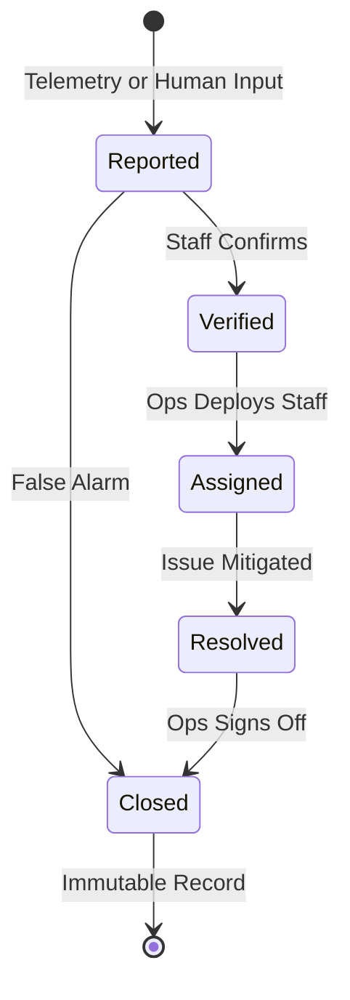
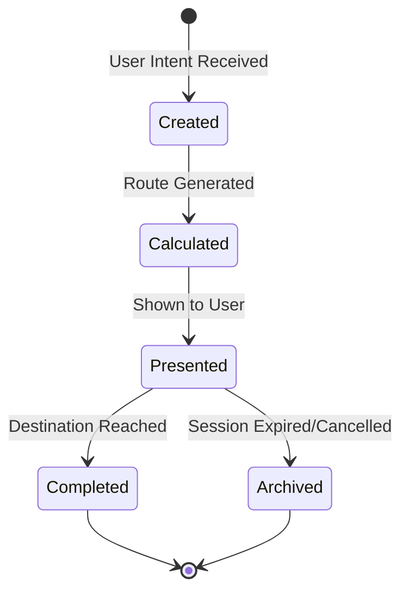
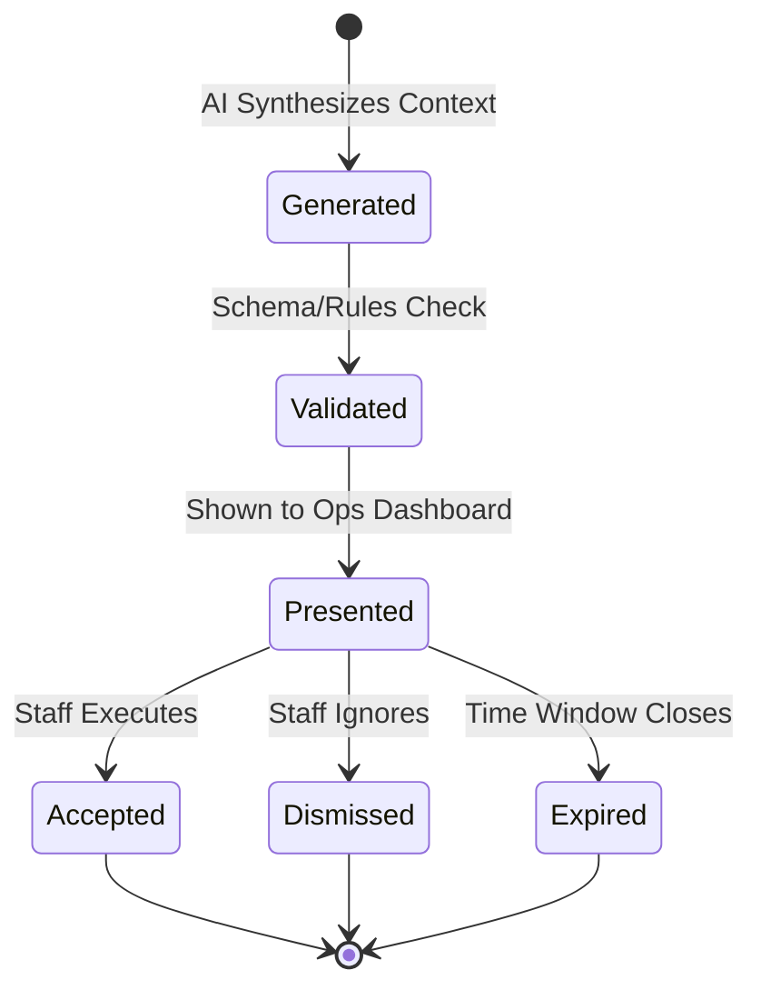
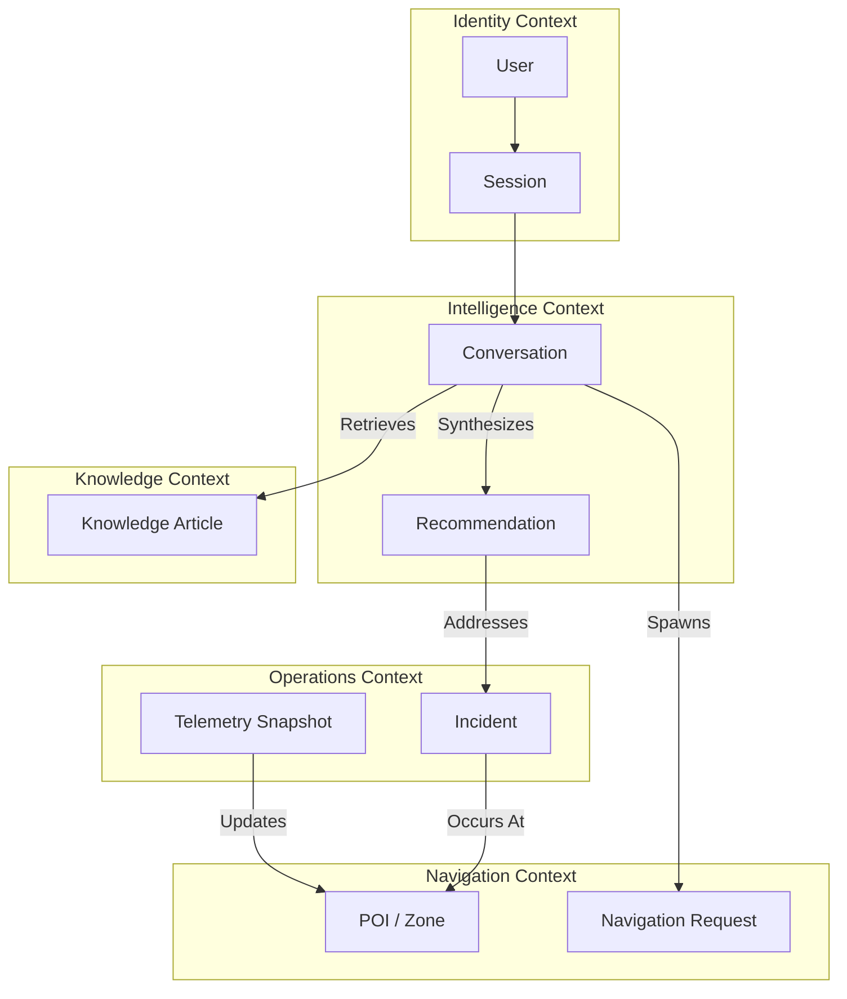
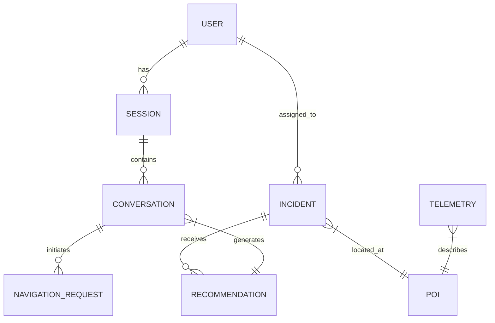

# FIFACoOS - Domain Model

## 1. Document Information
- **Version:** 1.0 (Initial Draft)
- **Status:** Under Review
- **Author:** Principal Architecture Team
- **Last Updated:** 2026-07-08

## 2. Purpose
This document defines the conceptual data model and business domain of FIFACoOS. It serves as the single source of truth for the business entities, their relationships, lifecycles, and the rules that govern them. It deliberately defers technology-specific implementation details (e.g., SQL, ORM, databases) to focus purely on the ubiquitous language and domain-driven design of the platform.

## 3. Relationship to Previous Documents
- **PRD:** Defines the product requirements. This model codifies the business concepts (Fans, Incidents, Staff, UIE) identified there.
- **ARCHITECTURE.md & SYSTEM_DESIGN.md:** Establish the structural boundaries and system actors. This model details the exact data structures and entities exchanged across those boundaries.
- **AI_ARCHITECTURE.md:** Defines the intelligence layer. This model defines the specific boundaries between AI-generated outputs (Recommendations) and deterministic operational data.

## 4. Domain Modeling Philosophy
- **Ubiquitous Language:** The terms defined here must be used consistently across all future code, APIs, and documentation.
- **Technology Agnostic:** This model avoids specifying databases, primary keys, or foreign keys. It focuses on conceptual relationships and ownership.
- **Explicit Boundaries:** Clear demarcation between authoritative operational data and probabilistic AI-generated insights.
- **Read-Optimized Thinking:** Recognizing that Fan interactions are read-heavy, the model groups data conceptually to favor rapid state retrieval.

## 5. Core Domain Overview
The FIFACoOS business domain is divided into several major areas representing stadium operations and fan experience:
- **Identity & Access:** Managing who is interacting with the system and their operational authority.
- **Stadium Operations:** The real-time management of venue state, incidents, staff deployments, and crowd dynamics.
- **Navigation & Wayfinding:** Spatial awareness, points of interest, and routing across the stadium.
- **Policy & Knowledge:** The static operational rules, FAQs, and Standard Operating Procedures (SOPs).
- **Intelligence (AI):** The synthesis of operational context into natural language assistance and actionable recommendations.

## 6. Bounded Contexts

### Identity & Access Context
- **Purpose:** Controls system access and role assignment.
- **Responsibilities:** Authenticating staff/volunteers and managing temporary anonymous sessions for fans.
- **Owned Entities:** User, Session, Role.
- **Interactions:** Provides authorization context to all other bounded contexts.

### Stadium Operations Context
- **Purpose:** The core operational reality of the venue.
- **Responsibilities:** Tracking incidents, managing staff deployments, and recording telemetry (crowd density, wait times).
- **Owned Entities:** Incident, Telemetry Snapshot, Assignment, Venue State.
- **Interactions:** Supplies operational context to the Intelligence Context for recommendations.

### Navigation Context
- **Purpose:** Spatial routing and venue geography.
- **Responsibilities:** Managing Points of Interest (POIs) and calculating routes.
- **Owned Entities:** POI, Zone/Sector, Route, Navigation Request.
- **Interactions:** Consumes Telemetry (e.g., closed gates) to adjust routing; provides routes to users.

### Intelligence Context (UIE)
- **Purpose:** AI reasoning and decision support.
- **Responsibilities:** Intent classification, summarization, and recommendation generation.
- **Owned Entities:** Recommendation, AI Insight, Conversation.
- **Interactions:** Consumes data from all other contexts securely; outputs non-authoritative recommendations to Operations.

### Policy & Knowledge Context
- **Purpose:** Static operational guidelines.
- **Responsibilities:** Storing SOPs, venue rules, and FAQs.
- **Owned Entities:** Knowledge Article, SOP, Protocol.
- **Interactions:** Looked up by the Intelligence Context to answer Volunteer or Fan questions.

*Reason for Separation:* Separating these contexts ensures that the probabilistic nature of the Intelligence Context does not corrupt the deterministic data in the Stadium Operations Context. Furthermore, Wayfinding and Knowledge are heavily read-optimized, while Operations is highly transactional.

## 7. Domain Entities

### User
- **Purpose:** Represents an actor interacting with the system.
- **Responsibilities:** Holds role, language preferences, and accessibility needs.
- **Owner:** Identity Context.
- **Relationships:** Has many Sessions; can be assigned to Incidents (if Staff).
- **Lifecycle:** Created -> Active -> Archived. (Fans have ephemeral users).
- **Rules:** Fan users are anonymous and hold no sensitive PII.
- **Classification:** Internal (Staff), Public (Anonymous Fan).
- **Mutable vs Immutable:** Preferences mutable; Role highly controlled.

### Session
- **Purpose:** A temporary interaction window for a User.
- **Owner:** Identity Context.
- **Relationships:** Belongs to a User; Contains Conversations.
- **Lifecycle:** Initiated -> Active -> Expired.
- **Rules:** Holds ephemeral context like current physical location.

### Incident
- **Purpose:** A discrete operational anomaly or event (e.g., medical emergency, spill).
- **Responsibilities:** Tracking status, severity, and assigned staff.
- **Owner:** Operations Context.
- **Relationships:** Located at a POI/Zone; Has many Recommendations; Has assigned Users.
- **Lifecycle:** Reported -> Verified -> Assigned -> Resolved -> Closed.
- **Rules:** Immutable once closed; Only visible to authenticated Staff/Security.
- **Classification:** Restricted.

### Telemetry Snapshot
- **Purpose:** A point-in-time capture of stadium sensor data (simulated).
- **Owner:** Operations Context.
- **Relationships:** Applies to a Zone/POI.
- **Lifecycle:** Generated -> Active -> Archived.
- **Rules:** Completely immutable upon creation.
- **Classification:** Internal.

### POI (Point of Interest)
- **Purpose:** A significant location (Gate, Concession, Restroom).
- **Owner:** Navigation Context.
- **Relationships:** Exists within a Zone.
- **Lifecycle:** Static for the tournament duration.
- **Rules:** Must have accessibility flags (e.g., wheelchair accessible).
- **Classification:** Public.

### Navigation Request
- **Purpose:** A user's intent to move from A to B.
- **Owner:** Navigation Context.
- **Relationships:** Origin POI, Destination POI.
- **Lifecycle:** Created -> Calculated -> Presented -> Completed.
- **Rules:** Must respect the User's accessibility preferences.
- **Classification:** Public/Ephemeral.

### Conversation
- **Purpose:** A chat thread between a User and the AI Copilot.
- **Owner:** Intelligence Context.
- **Relationships:** Belongs to a Session; Generates Navigation Requests or Recommendations.
- **Lifecycle:** Started -> Ongoing -> Archived.
- **Rules:** Fan conversations are strictly ephemeral and purged post-session.
- **Classification:** Public (Fan), Internal (Staff).

### Recommendation
- **Purpose:** An AI-generated suggestion for operational action.
- **Owner:** Intelligence Context.
- **Relationships:** Linked to an Incident or Zone; Target User (Staff).
- **Lifecycle:** Generated -> Validated -> Presented -> (Accepted/Dismissed) -> Expired.
- **Rules:** Never executes automatically. Must be human-approved.
- **Classification:** Internal.

### Knowledge Article
- **Purpose:** A policy, SOP, or FAQ.
- **Owner:** Policy Context.
- **Lifecycle:** Drafted -> Published -> Superseded.
- **Rules:** Version controlled.
- **Classification:** Varies (Public FAQs vs Restricted Security SOPs).

## 8. Value Objects

- **Location:** (Coordinates, Zone ID, Elevation/Floor). Represents a physical spot. Reusable across Incidents, POIs, and Users.
- **Language:** (Locale Code like EN, ES, FR, HI).
- **Route:** An ordered list of path nodes with an estimated time of arrival.
- **Severity:** (Low, Medium, High, Critical). Used for Incidents.
- **Confidence Score:** (Percentage 0-100). Represents the AI's certainty regarding a Recommendation or categorization.
- **Accessibility Requirement:** Flag or profile (e.g., Wheelchair, Low Vision) used in Wayfinding.

*Why Value Objects?* These concepts describe attributes of entities but lack a distinct conceptual identity themselves. Two Location objects with the same coordinates are completely interchangeable.

## 9. Aggregates

### 1. Incident Aggregate
- **Root Entity:** Incident.
- **Members:** Incident Updates, Assigned Staff IDs, AI Recommendations.
- **Boundaries:** All state changes to an Incident (e.g., adding an update, changing status) must pass through the Incident root to ensure consistency.
- **Consistency Rules:** An Incident cannot be 'Resolved' without an assignment history or resolution note.

### 2. User Session Aggregate
- **Root Entity:** User.
- **Members:** Active Session, Current Location, Conversations.
- **Boundaries:** Manages the active state of a user navigating the venue.
- **Consistency Rules:** If a session expires, ephemeral Fan conversations within it are orphaned/deleted.

### 3. Venue Geography Aggregate
- **Root Entity:** Venue.
- **Members:** Zones, POIs, Routing Graph.
- **Boundaries:** Encapsulates the static layout of the stadium.
- **Consistency Rules:** A POI cannot exist outside a defined Zone.

## 10. Entity Relationships

- **User (Staff)** `1..*` -> `Assigns` -> `0..*` **Incident**
- **User** `1` -> `Owns` -> `1..*` **Session**
- **Session** `1` -> `Contains` -> `0..*` **Conversation**
- **Conversation** `1` -> `Spawns` -> `0..*` **Recommendation** (Ops) OR **Navigation Request** (Fan)
- **Incident** `1` -> `Occurs At` -> `1` **Location (Value Object)**
- **Telemetry Snapshot** `1..*` -> `Describes` -> `1` **Zone/POI**
- **Recommendation** `0..*` -> `Addresses` -> `1` **Incident / Zone**

## 11. Entity Lifecycles

### Incident Lifecycle

### Navigation Request Lifecycle

### Recommendation Lifecycle

## 12. Data Ownership
- **User Context Owns:** Preferences, language, session state, accessibility profiles.
- **Operations Context Owns:** Incidents, assignments, telemetry state, alerts.
- **Intelligence Context Owns:** Recommendations, reasoning metadata, confidence scores, conversation parsing logs.
- **Navigation Context Owns:** POIs, routes, venue graph.
- **System Owns:** Audit logs, archived metrics.

## 13. Data Classification
- **Public:** Wayfinding POIs, General FAQs, Fan Navigation Requests, Concession Wait Times. (No auth needed).
- **Internal:** Crowd density heatmaps, Staff locations, Volunteer Schedules, System Telemetry. (Requires Staff/Vol Auth).
- **Restricted:** Security Incidents, Emergency SOPs, VIP movements, raw CCTV metadata. (Requires strictly Security/Manager Auth).
- *Impact on Security:* The Intelligence Context cannot ingest Restricted data when communicating with a Public User.

## 14. Data Lifecycle
- **Ephemeral (Seconds/Minutes):** Navigation requests, AI reasoning scratchpads, Fan session context. Purged immediately or upon session end.
- **Session (Hours):** User login states, active chat histories during a match.
- **Persistent (Days/Months):** Active incidents, daily telemetry, user accounts.
- **Historical/Archived (Years):** Closed incidents, summarized post-match heatmaps, audit logs. Used for post-tournament analytics.

## 15. Business Rules
- **Rule 1 (Data Segregation):** Fans cannot access, query, or receive AI context regarding operational incidents or staff telemetry.
- **Rule 2 (AI Authority):** AI Recommendations never modify operational state (e.g., they cannot close an Incident automatically).
- **Rule 3 (Immutability):** Operational events (Telemetry Snapshots) and closed Incidents are strictly immutable.
- **Rule 4 (Accessibility Override):** If a user session has an Accessibility Requirement, all Navigation Requests must filter out non-compliant routes, overriding speed or distance optimization.
- **Rule 5 (Emergency Override):** Emergency workflows trigger deterministic SOP retrieval. AI generative reasoning is bypassed for acute life-safety routing.
- **Rule 6 (Graceful Degradation):** Navigation Requests and SOP lookups must remain functional via deterministic caches if the Intelligence Context is offline.

## 16. AI-Generated Domain Objects
Information produced probabilistically by the Unified Intelligence Engine:
- **Recommendations:** Suggestions for staff deployment or crowd rerouting.
- **Summaries:** Natural language briefs aggregating multiple incident reports.
- **Risk Assessments:** Flagging a rapidly growing crowd as a potential bottleneck.
- **Confidence Scores:** Attached to every AI output to inform the UI whether to request human verification.
- **Translated Intents:** Mapping "Dónde está el baño" to `{ intent: "navigate", POI: "restroom" }`.
*Persistence & Validation:* All AI objects must pass a strict schema validation check before persisting. They are clearly marked in the UI as AI-generated and are never considered authoritative until a human accepts them.

## 17. Domain Events
Significant state changes that trigger workflows:
- `IncidentReported`: Triggers AI synthesis and alerts Ops dashboard.
- `CrowdDensityThresholdExceeded`: Triggers AI to generate a deployment `Recommendation`.
- `RecommendationAccepted`: Triggers staff deployment updates.
- `NavigationRequested`: Logs anonymized path usage for crowd flow analytics.
- `EmergencyDeclared`: Triggers mass notification and alters all Fan `NavigationRequests` to evacuation routes.
- `MatchPhaseChanged` (e.g., Halftime): Triggers massive telemetry generation for concession queues.

## 18. Future Evolution
The Domain Model is designed to scale without major structural changes:
- **Multiple Stadiums:** The `Venue` aggregate can become a parent to multiple stadiums. `Zones` become scoped to specific `Venues`.
- **Tournament Concepts:** Introduce `Match` and `Tournament` entities that own the `Venues` temporarily.
- **Real Sensors (IoT):** The `Telemetry Snapshot` entity remains identical; only the ingestion source changes from the Simulated Engine to an AWS IoT gateway.
- **Ticket Integration:** Transition Fan `Session` from Ephemeral to Persistent by linking a `Ticket` entity to a registered `User`.

## 19. Diagrams

### Domain Context Map

### Entity Relationship Diagram (Conceptual)

## 20. Design Review
- **Strengths:** Clear separation between deterministic operational data and AI-generated insights. Read-optimized for Fan experiences. Strict boundaries ensure security and data isolation.
- **Weaknesses:** Polling-based telemetry (System Design) might require frequent updates to the `Telemetry Snapshot` entities, potentially creating large historical data volumes quickly.
- **Assumptions:** Assumes fan interactions can remain largely stateless and anonymous for the MVP.
- **Risks:** The Intelligence Context acting across all domains requires very strict context curation to prevent data leakage between Ops and Fans.
- **Future Refactoring:** If Fan accounts are introduced, the `User` aggregate will grow significantly to handle personalized preferences and ticketing.

## 21. Consistency Review
- **PRD:** Adheres to the MVP scope, personas (Mateo, Sarah), and the principle that AI augments but does not automate.
- **ARCHITECTURE.md:** Aligns perfectly with the layered design and separation of the Unified Intelligence Engine.
- **SYSTEM_DESIGN.md:** Reflects the Orchestrator's role in brokering between domains and the UIE.
- **AI_ARCHITECTURE.md:** Embeds the safety and fallback logic into the domain rules (e.g., Confidence Scores, Recommendations requiring human acceptance).

## 22. Executive Summary
- **Purpose:** This Domain Model defines the ubiquitous language, business entities, and relationship boundaries for FIFACoOS, acting as the foundation for all future database and API designs.
- **Core Business Entities:** User, Session, Incident, POI, Navigation Request, Telemetry Snapshot, Conversation, Recommendation, Knowledge Article.
- **Aggregate Roots:** Incident (Operations), User/Session (Identity), Venue (Navigation).
- **Key Business Rules:** 
  1. AI Recommendations are never authoritative and cannot modify operational state automatically.
  2. Public Fan contexts must never intersect with Restricted operational telemetry or incident data.
  3. Closed incidents and telemetry snapshots are immutable.
  4. Accessibility requirements strictly override standard routing optimizations.
- **Deferred Technical Decisions:** Specific database technologies (SQL vs NoSQL), table schemas, primary/foreign key structures, and ORM mapping are intentionally deferred to the subsequent Database Design phase.
- **Dependents:** The upcoming Database Schema Design, API Contracts, and core domain application logic will directly depend on the entities and rules established in this document.
