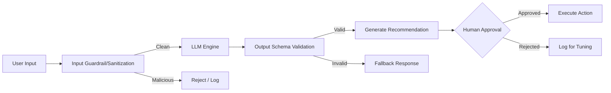

# FIFACoOS - Security Architecture

## 1. Document Information
- **Version:** 1.0
- **Status:** Approved (Frozen)
- **Author:** Principal Security Architecture Team
- **Last Updated:** Architecture Synchronization Review
- **Depends On:** SYSTEM_DESIGN.md, AI_ARCHITECTURE.md, API_DESIGN.md, DATABASE_SCHEMA.md
- **Supersedes:** None

## 2. Purpose
This document defines the comprehensive, implementation-independent security architecture for the FIFACoOS Smart Stadium platform. It establishes the principles, boundaries, and strategies required to protect the platform's confidentiality, integrity, availability, and privacy across all tiers, including the integrated AI subsystem.

## 3. Relationship to Previous Documents
This document aligns with and enforces the requirements set forth in:
- **PRD:** Enforces access tiers (Anonymous Fans vs. Authenticated Staff) and privacy mandates.
- **SYSTEM_DESIGN.md:** Applies security controls to the stateless application tiers and real-time infrastructure.
- **AI_ARCHITECTURE.md:** Provides the security envelope and guardrails for the Unified Intelligence Engine (UIE).
- **DATABASE_SCHEMA.md:** Reinforces the logical isolation (e.g., Row Level Security) and auditability concepts.
- **API_DESIGN.md:** Dictates the security mechanisms (authentication, rate limiting) for the defined API contracts.

## 4. Security Design Principles
- **Zero Trust Architecture (ZTA):** Never trust, always verify. No implicit trust is granted based on network location. Every request must be authenticated and authorized.
- **Defense in Depth:** Security controls are applied in multiple, overlapping layers (Edge, API Gateway, Application, Database).
- **Secure by Default:** The default configuration for any component must be the most secure posture (e.g., deny all).
- **Principle of Least Privilege (PoLP):** Users, services, and AI models are granted only the minimum permissions necessary to perform their legitimate functions.
- **AI Safety & Bounded Autonomy:** AI outputs are treated as untrusted user input. AI cannot execute operational changes without explicit, authenticated human validation.

## 5. Security Goals
- **Confidentiality:** Ensure sensitive operational data (e.g., security incident locations) and user context are accessible only to authorized entities.
- **Integrity:** Prevent unauthorized modification of telemetry data, incident reports, and system configurations.
- **Availability:** Ensure the platform remains operational and responsive under high-load event conditions and targeted DDoS attacks.
- **Privacy:** Protect anonymous fan identities and minimize data collection to strictly operational necessity.
- **Auditability:** Maintain immutable, cryptographically verifiable logs of all significant security and operational events.

## 6. Threat Model

### System Boundaries and Trust Zones
The system is divided into logical trust zones:
- **Untrusted Zone:** Public Internet (Fan Mobile App).
- **Semi-Trusted Zone:** Edge CDN, WAF, API Gateway.
- **Trusted Zone:** Application Services, Unified Intelligence Engine (UIE), Internal Event Bus.
- **Highly Trusted Zone:** Core Database, Secrets Management, Telemetry Data Store.

```mermaid
flowchart TD
    subgraph Untrusted [Untrusted Zone]
        Fan[Fan App]
        Attacker[Malicious Actor]
    end
    
    subgraph SemiTrusted [Semi-Trusted Zone]
        WAF[Web Application Firewall]
        Gateway[API Gateway]
    end
    
    subgraph Trusted [Trusted Zone]
        Services[Application Services]
        AI[Unified Intelligence Engine (UIE)]
    end
    
    subgraph HighlyTrusted [Highly Trusted Zone]
        DB[(Primary Database)]
        Secrets[Secrets Vault]
    end
    
    Fan --> WAF
    Attacker --> WAF
    WAF --> Gateway
    Gateway --> Services
    Services --> AI
    Services --> DB
    Services --> Secrets
```

### Assets
- **Primary Assets:** Telemetry data, Incident records, AI Recommendations, User session context, Wayfinding graphs.

### Threat Actors
- **Opportunistic Attackers:** Script kiddies attempting common web exploits.
- **Malicious Fans:** Users attempting to spoof location data, spam navigation requests, or poison the AI context via chat.
- **Compromised Insiders:** Staff with legitimate access whose accounts have been hijacked.

### Attack Surfaces
- Public API endpoints (REST/WebSockets).
- Unified Intelligence Engine (UIE) natural language interface (Prompt Injection).
- Telemetry ingestion endpoints.
- Staff dashboard interfaces.

## 7. Identity & Authentication

### Authentication Philosophy
Authentication is decoupled from authorization. The platform relies on modern, token-based authentication mechanisms, isolating user identity from core application logic.

### User Tiers
- **Anonymous Fan Access:** Ephemeral, device-bound session tokens. Device fingerprints shall be transformed into a non-reversible cryptographic representation before storage. No Personally Identifiable Information (PII) is required or collected. Sessions are scoped to the duration of the event.
- **Authenticated Staff (Operations, Security, Volunteers):** Strongly authenticated identities.

### Identity Lifecycle
- **Provisioning:** Staff accounts are provisioned via a central identity provider (IdP).
- **Session Management:** Short-lived access tokens with secure, rotation-based refresh tokens. Anonymous sessions expire automatically.
- **Future Federation:** The architecture is designed to support SAML/OIDC federation for integrating with venue-specific identity providers.
- **Passwordless:** Staff authentication should prioritize passwordless methods (e.g., biometric WebAuthn or Magic Links) to reduce credential theft risk.

## 8. Authorization

### Role-Based Access Control (RBAC) Model
Authorization is strictly enforced at the API Gateway and Application layers, and backed by database-level Row Level Security (RLS).

### Defined Roles
- **Fan (Anonymous):** Read-only access to public zones, POIs, and personal navigation requests. Fans access wait times exclusively via sanitized Orchestrator endpoints, with no direct read access to telemetry records.
- **Volunteer:** Read access to general incident status; write access to report incidents.
- **Security/Operations Staff:** Read/write access to sensitive incidents, telemetry analytics, and AI recommendations.
- **Administrator:** Full system configuration access; cannot view personal fan session data.

### Privilege Boundaries & Least Privilege
- **Resource Ownership:** Fans can only access data tied to their specific ephemeral session token.
- **Horizontal & Vertical Privilege Escalation Prevention:** API endpoints strictly validate both the user's role (vertical) and their ownership of the requested resource ID (horizontal).

## 9. Data Security

### Data Classification
- **Public:** Stadium maps, POI lists, public announcements.
- **Internal:** Aggregated telemetry, general incident counts.
- **Confidential:** Specific security incident details, staff assignments, AI reasoning logs.
- **Restricted:** Infrastructure secrets, cryptographic keys.

### Security Controls
- **Encryption in Transit:** All communications (internal and external) mandate TLS 1.3.
- **Encryption at Rest:** All databases and persistent storage volumes utilize industry-standard AES-256 encryption.
- **Data Minimization:** The system actively avoids collecting PII from fans. Location data is ephemeral and tied to anonymous sessions, not permanent identities.
- **Retention and Secure Deletion:** Anonymous session data and location history are cryptographically shredded/purged post-event. Operational telemetry is aggregated and anonymized for long-term storage.

## 10. AI Security
*This subsystem represents a unique attack surface and requires specialized controls.*

### Threats
- **Prompt Injection & Indirect Injection:** Malicious fans crafting chat inputs, or attackers poisoning external data sources, to bypass AI instructions.
- **Context Poisoning:** Manipulating incident reports to force the AI to make bad recommendations.
- **Hallucinations & Unsafe Outputs:** The LLM generating incorrect, unsafe, or panic-inducing crowd control advice.
- **Data Leakage:** The LLM inadvertently revealing sensitive operational data to a fan.
- **Model Abuse:** Automated scraping or excessive querying to exhaust resources.

### Mitigations
- **Strict Persona Isolation:** The AI operates distinct, isolated pipelines for Fans vs. Staff. A Fan AI pipeline has absolutely no access to the operational database context.
- **Input Guardrails:** All user input to the AI is sanitized and passed through a lightweight classifier to detect injection attempts before reaching the core LLM.
- **Output Verification:** AI responses are validated against a rigid JSON schema and checked by an output classifier for safety before being returned to the user.
- **Human-in-the-Loop (HITL):** **Crucial Principle.** The AI *never* executes operational changes (e.g., dispatching security, changing digital signage). It generates *recommendations* which must be explicitly validated and approved by an Authenticated Ops Staff member.
- **Fallback Behavior:** If the AI confidence score is low or guardrails are triggered, the system degrades gracefully to standard, non-AI deterministic responses or routing.



## 11. Application Security

### Defensive Philosophy
The application tier assumes all input is malicious.

- **Injection Attacks:** Prevented via mandatory use of parameterized queries and ORMs. No dynamic query construction is permitted.
- **Cross-Site Scripting (XSS):** Prevented via strict output encoding, use of modern frontend frameworks with built-in escaping, and robust Content Security Policies (CSP).
- **CSRF:** Mitigated via SameSite cookie attributes and stateless token-based authentication (where applicable).
- **Input Validation:** All input is strongly typed and validated against strict schemas at the API boundary.
- **Rate Limiting:** Granular, distributed rate limiting at the API Gateway based on IP, session ID, and endpoint criticality to prevent abuse and DoS.
- **Session Fixation & Replay:** Prevented via secure token issuance, nonces, and short token lifespans.
- **Clickjacking & Open Redirects:** Prevented via strict HTTP headers (`X-Frame-Options`, strict referer validation).

## 12. API Security
- **Request/Response Validation:** All API contracts (OpenAPI/AsyncAPI) are strictly enforced at runtime. Unexpected payloads are dropped.
- **Authentication & Authorization:** Gateway validates tokens cryptographically before routing; upstream services re-validate claims (defense in depth).
- **Least Privilege APIs:** Microservices expose only the endpoints necessary for their specific domain.
- **Idempotency & Replay Protection:** All state-mutating requests (POST/PUT/PATCH) mandate idempotency keys.
- **API Versioning:** Strict versioning ensures legacy clients do not expose security vulnerabilities through deprecated endpoints.
- **Error Handling:** Standardized API error responses must never leak stack traces, database schema details, or internal service topology.

## 13. Privacy
- **Consent Philosophy:** Fans opt-in to location services dynamically. The system functions gracefully (with reduced context) if location is denied.
- **Personally Identifiable Information (PII):** Strictly minimized. Fan tracking is entirely anonymous.
- **Operational Confidentiality:** Staff activity is logged for security and accountability, but strictly isolated from public access.
- **Data Ownership:** Venue operators own operational data. Fans retain agency over their ephemeral session state.
- **Compliance Considerations:** Designed to natively comply with global privacy standards (e.g., GDPR, CCPA) through its "privacy by design" and anonymization-first architecture.

## 14. Auditability

### What is Logged
- **Security Logs:** Authentication successes/failures, authorization denials, API rate limit triggers, guardrail violations.
- **Operational Logs:** Changes to incidents, staff assignments, system configuration modifications.
- **AI Recommendations:** Every AI recommendation logs the prompt, the context provided, the raw output, and the ID of the human who approved/rejected it.
- **Administrative Actions:** All actions taken by Administrators.

### What is NEVER Logged
- Passwords or credentials.
- Full Bearer tokens or Session Keys.
- Sensitive PII (if ever accidentally ingested).
- Unredacted sensitive chat contents.

## 15. Secrets Management
- **Principle of Least Exposure:** Secrets are never hardcoded or checked into version control.
- **Credential Isolation:** Application services retrieve secrets dynamically at runtime from a centralized, encrypted Secrets Vault.
- **Key Rotation:** Automated, zero-downtime rotation of database credentials, API keys, and cryptographic signing keys.
- **Environment Variables:** Securely injected at deployment time; never logged or exposed in stack traces.

## 16. Security Monitoring
- **Intrusion Detection:** Continuous monitoring of edge traffic for anomalous patterns.
- **AI Misuse Detection:** Alerting on high frequencies of prompt injection triggers or rejected AI recommendations.
- **Rate Abuse Detection:** Real-time dashboards tracking API Gateway rate limit violations, indicating potential scraping or DoS attempts.
- **Anomaly Detection:** Behavioral monitoring to detect compromised staff accounts acting outside normal patterns.

## 17. Failure Recovery
- **Graceful Degradation:**
  - *If AI is unavailable:* Fallback to standard shortest-path routing and manual incident logging.
  - *If Authentication fails:* Existing valid sessions continue until expiry; new anonymous sessions can be generated locally (offline mode), but staff cannot login.
  - *Permission Service Failure:* Fail closed (deny all) to prevent unauthorized access.
- **Incident Response:** Automated circuit breakers isolate failing components to prevent cascading outages across the trusted zone. Partial outages maintain critical life-safety functionality.

## 18. Multi-Tenancy & Isolation
- **Conceptual Isolation:** The database logical schema enforces strict data siloing. A Fan's query cannot traverse into the Operational schemas.
- **Subsystem Isolation:** The AI subsystem operates in a sandboxed environment, separated logically from administrative functions.
- **Future Proofing (Multi-Venue):** The architecture is designed so that logical tenant IDs can be introduced at the Gateway/DB layer to support multiple stadiums securely within the same physical infrastructure.

## 19. Risk Assessment

| Risk Scenario | Likelihood | Impact | Mitigation Strategy | Residual Risk |
| :--- | :--- | :--- | :--- | :--- |
| **DDoS Attack on API** | High | Medium | Edge CDN caching, aggressive API Gateway rate limiting, auto-scaling. | Low |
| **AI Prompt Injection** | High | Medium | Strict input guardrails, HITL requirement for actions, isolated Fan/Staff models. | Low |
| **Unauthorized Incident Access** | Low | High | Enforced RBAC at Gateway, Row Level Security (RLS) in Database. | Low |
| **Telemetry Spoofing** | Medium | Medium | IoT endpoint mutual TLS, anomaly detection in Telemetry Engine. | Low |
| **Session Hijacking** | Low | High | Short-lived tokens, TLS 1.3 requirement, device fingerprinting. | Low |

## 20. Design Trade-offs
- **Human-in-the-Loop vs. Automation Speed:**
  - *Why Chosen:* AI cannot autonomously execute operational commands.
  - *Benefits:* Guarantees absolute safety and accountability, preventing AI-driven chaos in a physical environment.
  - *Limitations:* Slower response times for mitigating incidents.
  - *Future Evolution:* Gradual introduction of automated low-risk actions as AI confidence models mature.
- **Anonymous Sessions vs. Personalization:**
  - *Why Chosen:* No persistent fan accounts are created.
  - *Benefits:* Massively reduces privacy compliance overhead and PII breach risk.
  - *Limitations:* Loss of long-term user behavior analytics across multiple events.
  - *Future Evolution:* Opt-in persistent profiles for season ticket holders.

## 21. Consistency Review
- **PRD:** Fully consistent. Enforces anonymous fans and authenticated staff boundaries.
- **ARCHITECTURE.md & SYSTEM_DESIGN.md:** Consistent. Applies Edge and Gateway controls appropriate for the stateless, event-driven design.
- **AI_ARCHITECTURE.md:** Consistent. Validates the RAG approach while enforcing strict guardrails and HITL.
- **DATABASE_SCHEMA.md & API_DESIGN.md:** Consistent. Reinforces RLS, session tokens, and strict validation.
- *Status:* No conflicts detected.

---

## 22. Executive Summary

**Purpose:** This document outlines the foundational security architecture for the FIFACoOS platform, ensuring the protection of physical operations and digital interactions during high-stakes stadium events.

**Major Security Principles:** The architecture is built on Zero Trust Principles, Defense in Depth, and Secure by Default configurations. It strictly separates authentication from authorization and heavily enforces the Principle of Least Privilege.

**Authentication & Authorization:** The platform utilizes a dual-tier identity model: ephemeral, anonymous, privacy-preserving sessions for Fans, and strongly authenticated, centralized identities for Staff. Authorization relies on a strict Role-Based Access Control (RBAC) model enforced by the API Gateway and database Row Level Security.

**AI Security Philosophy:** AI is treated as an untrusted, highly capable component. It is bounded by strict input/output guardrails, context isolation between user tiers, and a mandatory Human-in-the-Loop (HITL) policy preventing autonomous operational execution.

**Key Risks & Boundaries:** The primary risks involve DDoS, prompt injection, and telemetry spoofing. These are mitigated across clearly defined trust boundaries (Untrusted, Semi-Trusted, Trusted, Highly Trusted) using edge protection, API validation, and robust monitoring.

**Dependencies:** This design fulfills requirements from the PRD, System Design, AI Architecture, Database Schema, and API Design documents. 

**Future Documents:** Future infrastructure-as-code and application implementation phases strictly depend on these security mandates. 

**Deferred Decisions:** Technical choices regarding specific cloud providers, specific WAF vendors, identity federation providers, or exact encryption libraries are intentionally deferred to future implementation phases to maintain technology agnosticism at this design stage.
