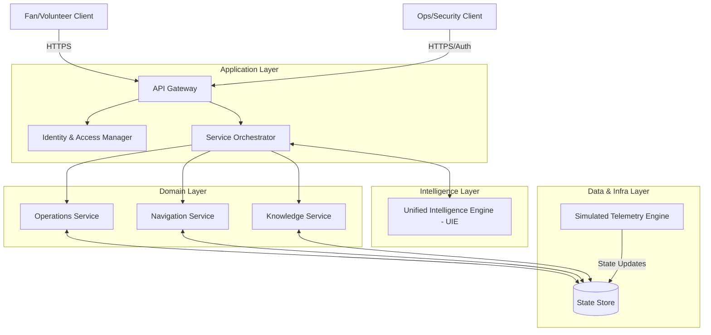
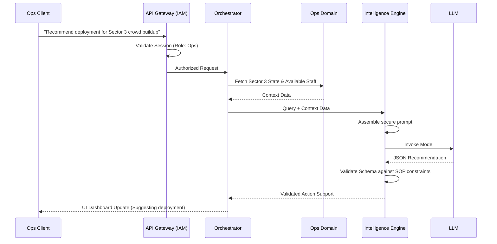
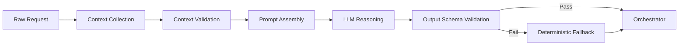

# FIFACoOS - System Design Document

## 1. Document Information
- **Version:** 1.0
- **Status:** Approved (Frozen)
- **Author:** Principal Architecture Team
- **Last Updated:** Architecture Synchronization Review
- **Depends On:** ARCHITECTURE.md, PRD.md
- **Supersedes:** None

## 2. Purpose
This document bridges the gap between the high-level `ARCHITECTURE.md` and low-level implementation. It describes *how* the system behaves internally, component responsibilities, interaction models, request lifecycles, and failure handling strategies. It serves as the primary blueprint for the engineering team before defining specific APIs, schemas, or folder structures.

## 3. Relationship to Previous Documents
- **PRD:** Defines *what* we are building and *why*. This document dictates *how* the system fulfills those requirements (e.g., MVP scope, AI boundaries).
- **ARCHITECTURE.md:** Defines the layered structural principles. This document instantiates those layers into discrete interacting components.

## 4. Design Principles
- **Explicit Context Flow:** Data passed to the AI is explicitly curated by the domain layer. The AI cannot "fetch" data on its own.
- **Fail-Safe Processing:** If a component fails (especially the AI), the system falls back to a deterministic, safe state.
- **Stateless Orchestration:** Application services remain stateless. All state is externalized to the data layer to ensure horizontal scalability.
- **Read-Heavy Optimization:** Fan operations are predominantly read-heavy; the architecture optimizes for rapid state retrieval.

## 5. System Context
FIFACoOS operates as a centralized hub connecting human operators (staff, security), attendees (fans, volunteers), and simulated stadium sensors (telemetry). It orchestrates information flow, enforces security boundaries, and leverages an isolated Intelligence Engine to synthesize data and provide operational recommendations.

## 6. Primary Actors
- **Fans (Anonymous):** Request navigation, concessions info, and generic FAQs.
- **Ops/Security (Authenticated):** Request situational summaries, deployment recommendations, and monitor real-time dashboards.
- **Volunteers (Authenticated):** Request policy clarifications and emergency protocols.
- **Simulated Telemetry Engine (System Actor):** Continuously pushes state updates (crowd density, queues, incidents) into the system.

## 7. High-Level Component Diagram

## 8. Core Components

### 8.1. API Gateway / Router
- **Responsibility:** Ingress point for all client requests. Handles routing, rate-limiting, and basic payload validation.
- **Inputs:** HTTP requests from web clients.
- **Outputs:** Routed internal calls to the Application Layer; HTTP responses to clients.
- **Dependencies:** Identity & Access Manager.
- **Failure Scenarios:** Returns 429 on rate limit, 400 on invalid payload schema.

### 8.2. Identity & Access Manager (IAM)
- **Responsibility:** Validates authentication tokens and enforces Role-Based Access Control (RBAC).
- **Inputs:** Auth tokens or session identifiers.
- **Outputs:** Authorized context (User ID, Role, Permissions) or Rejection (401/403).
- **Dependencies:** State Store (for active sessions/roles).
- **Failure Scenarios:** Fails closed; unauthenticated requests are strictly rejected for restricted routes.

### 8.3. Service Orchestrator
- **Responsibility:** Coordinates workflows that span multiple domain modules. It intercepts requests, gathers required data from the Domain Layer, and determines if the Intelligence Layer is needed.
- **Inputs:** Validated, authorized internal requests.
- **Outputs:** Final aggregated data payloads for the client.
- **Dependencies:** Domain Modules, UIE.
- **Failure Scenarios:** Handles timeouts from downstream services, returning graceful degradation payloads.

### 8.4. Domain Services (Ops, Navigation, Knowledge)
- **Responsibility:** Own the strict business rules. Read/write to the Central State Store. 
  - *Ops:* Manages incident logic and crowd limits.
  - *Navigation:* Manages graph-based deterministic routing.
  - *Knowledge:* Retrieves static SOPs and rules.
- **Inputs:** Queries or mutations from the Orchestrator.
- **Outputs:** Domain objects (e.g., a "Route", an "Incident").
- **Dependencies:** State Store.
- **Failure Scenarios:** Returns specific domain errors (e.g., "Route Not Found", "Invalid Sector").

### 8.5. Unified Intelligence Engine (UIE)
- **Responsibility:** Handles all LLM interactions. Assembles prompts using context provided by the Orchestrator, invokes the LLM, and enforces output schema validation.
- **Inputs:** Natural language queries + strictly curated Context JSON (e.g., current crowd levels).
- **Outputs:** Validated JSON matching intent schemas (e.g., `{ intent: "navigate", destination: "Gate B" }`).
- **Dependencies:** External LLM Provider API.
- **Failure Scenarios:** LLM timeout, LLM hallucination (fails JSON schema validation). In all cases, returns a predefined "Deterministic Fallback" error to the Orchestrator.

### 8.6. Simulated Telemetry Engine
- **Responsibility:** A background process that updates the State Store with realistic mock data on a schedule (e.g., increasing crowd density at half-time).
- **Inputs:** Configuration/Scenario parameters.
- **Outputs:** Writes to the State Store.
- **Dependencies:** State Store.

## 9. Component Interaction Model
Components interact synchronously for client requests to simplify MVP delivery. The Orchestrator acts as the mediator. Domain services do not call the UIE directly; they supply state to the Orchestrator, which decides when to involve the UIE. The UIE acts as a pure function: `UIE(Query, Context) => Decision`.

## 10. End-to-End Request Lifecycles

### 10.1. Fan Requesting Navigation (AI Assisted)
1. **Client** sends: `"Where is the nearest medical tent? I am at Gate A."`
2. **API Gateway** accepts the anonymous request.
3. **Orchestrator** fetches current stadium POIs from the **Navigation Service**.
4. **Orchestrator** sends query + POI list to **UIE**.
5. **UIE** determines the intent is `navigate` and the destination is `Medical Tent 1` (closest to Gate A).
6. **Orchestrator** asks **Navigation Service** for the deterministic path from Gate A to Medical Tent 1.
7. Response is returned to the **Client**.

### 10.2. Fan Requesting Multilingual Assistance
1. **Client** sends a query in Spanish.
2. **API Gateway** forwards to **Orchestrator**.
3. **Orchestrator** includes user's locale setting in the context sent to **UIE**.
4. **UIE** prompt instructs the LLM to process the Spanish text and respond in Spanish.
5. Translated response is returned to the client. *Note: Domain data remains in a universal format; only the presentation string is localized.*

### 10.3. Operations User Requesting AI Recommendations

### 10.4. Incident Reporting
1. **Telemetry Engine** or **Staff** writes a new incident via the **Ops Domain**.
2. **Ops Domain** saves it to the State Store.
3. Connected Ops Clients pull the updated state (via polling).
4. Ops Manager clicks "Summarize Incident".
5. **Orchestrator** fetches all associated reports from the **Ops Domain** and passes them to the **UIE** for summarization.

### 10.5. Accessibility Assistance
1. **Fan Client** requests an "Accessible route to Seat 12B".
2. **UIE** maps this to `navigate_accessible` intent.
3. **Orchestrator** queries the **Navigation Service** with the `accessible: true` flag.
4. **Navigation Service** runs a deterministic graph search excluding stairs/steep inclines.
5. Safe route is returned.

## 11. AI Processing Pipeline

- **Context Collection:** Gathering deterministic data (e.g., current staff locations). Why? The AI cannot guess real-time data.
- **Context Validation:** Ensuring we don't pass sensitive security context for Fan queries. Why? Strict data segregation.
- **Prompt Assembly:** Injecting strict system instructions to limit the LLM's persona. Why? Mitigate prompt injection.
- **AI Reasoning:** The LLM synthesizes the data. Why AI? Deterministic code cannot easily summarize 5 conflicting text reports into one coherent brief.
- **Output Validation:** Using schema validators (e.g., Zod) on the LLM JSON. Why? LLMs hallucinate; we must ensure the structure exactly matches what the UI expects.

## 12. State Management Philosophy
- **Stateless Services:** All API Gateway, Orchestrator, Domain, and UIE components hold zero local state between requests. 
- **Stateful Data:** Operational data (incidents, crowd heatmaps) lives exclusively in the central State Store.
- **Session Context:** Handled securely via tokens, validated per request.
- **Temporary Context:** Chat history for the Fan Copilot is stored ephemerally (e.g., attached to a short-lived session ID).
- **Long-term Data:** SOPs and Venue maps are treated as highly cacheable, read-heavy data.

## 13. Communication Model
The MVP utilizes **Synchronous HTTP/REST** for all client-to-server interactions, and **Polling** for real-time dashboard updates. 
*Why?* To prioritize engineering velocity, testability, and architectural simplicity for the MVP scope.
*Future Evolution:* The architecture is designed so that the Polling mechanism can easily be swapped for Asynchronous WebSockets or Server-Sent Events (SSE) in a production environment without altering the Domain or Intelligence layers.

## 14. Failure Handling
- **AI Unavailable (Rate limits, API down):** UIE intercepts the error and returns a standard fallback object. The Fan UI displays static maps and emergency numbers. The Ops UI displays raw (unsummarized) incident feeds.
- **Invalid Requests:** API Gateway rejects malformed requests before they hit the Domain Layer, saving compute.
- **Missing Operational Data:** Domain services return empty state arrays rather than throwing fatal exceptions, allowing the UI to render empty states gracefully.

## 15. Security Boundaries
- **Public Access (Fans):** Strictly limited to the Navigation and Knowledge domains. Cannot query or mutate the Ops Domain. The context assembled for the UIE *never* includes security incidents. To provide real-time concession wait times, the Orchestrator securely fetches POI telemetry using a service identity and exposes only sanitized wait times to Fans.
- **Authenticated Access (Staff/Vols):** RBAC dictates which endpoints can be reached. The IAM sits before the Orchestrator, ensuring no unauthenticated request touches business logic.
- **AI Access Limitations:** The AI operates in a sandbox. It has zero permissions to read from or write to the database. It only sees what the Orchestrator explicitly hands it, and its outputs are strictly validated before being returned to the user.

## 16. Scalability Considerations
- Because the Application and Intelligence layers are stateless, they can be scaled horizontally behind a load balancer.
- Read-heavy Fan queries (e.g., "Where is Gate B?") can be aggressively cached at the edge or CDN level, bypassing the LLM entirely for frequent exact-match questions.
- The Simulated Telemetry Engine operates asynchronously to avoid tying up request threads.

## 17. Design Trade-offs
- **Polling vs. WebSockets:** 
  - *Chosen:* Polling. 
  - *Benefits:* Simpler infrastructure, easier to debug, stateless. 
  - *Limitations:* Slightly higher latency and network overhead.
- **LLM for Routing Intent vs. NLP Intent Engine:**
  - *Chosen:* LLM.
  - *Benefits:* Handles multilingual and highly contextual requests out-of-the-box (e.g., "I'm in a wheelchair and hungry, where do I go?").
  - *Limitations:* Slower than basic NLP regex matching. Mitigated via streaming UI.

## 18. Deferred Technical Decisions
The following specific implementation details are intentionally postponed to later design documents:
- **Database Architecture & Schema:** (SQL vs. NoSQL, Table structures).
- **API Contracts:** (REST OpenAPI definitions vs. tRPC/GraphQL).
- **UI Framework & State Management:** (e.g., Next.js vs. React SPA, Redux vs. Zustand).
- **LLM Provider Selection:** (e.g., Gemini, OpenAI, Claude).
- **Deployment Topology:** (Vercel, AWS, local containers).

## 19. System Design Review
- **Strengths:** Highly modular, secure by default, resilient to AI failures (graceful degradation), and explicitly separates deterministic logic from probabilistic AI.
- **Weaknesses:** Polling for real-time dashboard data is inefficient at high scale. The UIE's reliance on external LLM APIs introduces a hard dependency on network latency.
- **Risks:** LLM schema validation might fail frequently if the prompt is not strictly engineered, leading to high fallback rates.
- **Opportunities:** Future integration of an edge-caching layer for repeated AI queries could significantly reduce latency and API costs.

---

## Executive Summary
This document establishes the detailed System Design for FIFACoOS, bridging the high-level architecture to actionable component behaviors. 

**Major Design Decisions:**
- The system is built around a centralized **Service Orchestrator** that mediates between deterministic **Domain Modules** and a probabilistic **Unified Intelligence Engine (UIE)**. 
- The AI is strictly sandboxed; it cannot fetch data independently and cannot execute actions. It receives curated context and returns validated JSON recommendations.
- To ensure MVP delivery, the communication model favors synchronous HTTP and polling over complex event-driven WebSockets, while maintaining stateless application tiers for horizontal scalability.

**Dependencies:**
- This design completely conforms to the frozen PRD and `ARCHITECTURE.md`. 
- Future documents (Database Schema, API Design, and Implementation Plans) directly depend on the boundaries established here. Specific technical choices (database tech, LLM provider, API specs) are intentionally deferred to those upcoming phases.
