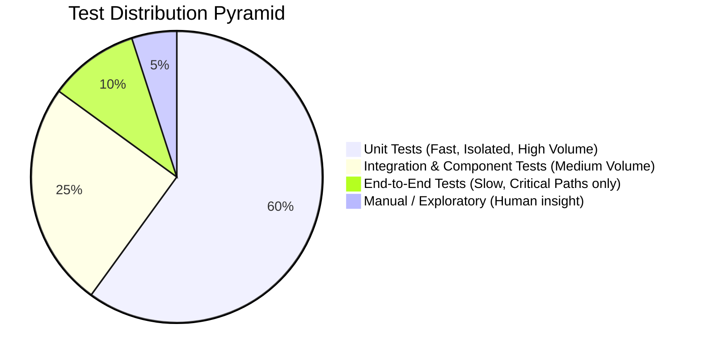
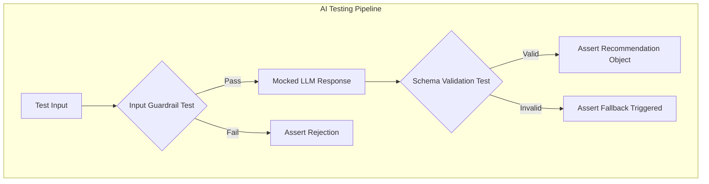
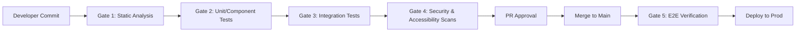
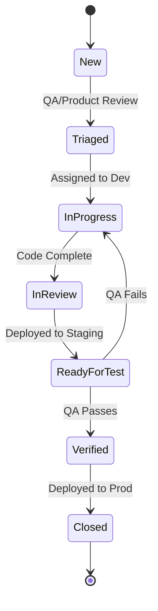

# FIFACoOS - Testing Strategy

## 1. Document Information
- **Version:** 1.0
- **Status:** Proposed
- **Author:** Principal Quality Assurance Architecture Team
- **Last Updated:** 2026-07-09

## 2. Purpose
This document defines the comprehensive testing philosophy, quality gates, and validation strategies for the FIFACoOS Smart Stadium platform. It establishes an implementation-independent framework to ensure the platform meets its strict requirements for correctness, reliability, security, accessibility, and AI safety without dictating specific testing tools or libraries.

## 3. Relationship to Previous Documents
This testing strategy ensures the verifiable implementation of the requirements defined in:
- **PRD:** Validates the anonymous fan experience and staff operational capabilities.
- **ARCHITECTURE.md & SYSTEM_DESIGN.md:** Validates the stateless, event-driven, real-time infrastructure.
- **AI_ARCHITECTURE.md:** Validates the LLM guardrails, output schemas, and Human-in-the-Loop workflows.
- **DATABASE_SCHEMA.md:** Validates RLS boundaries and data integrity constraints.
- **API_DESIGN.md:** Validates the contracts, rate limiting, and idempotency mechanisms.
- **SECURITY.md:** Validates the zero-trust principles, RBAC, and threat mitigations.

## 4. Testing Philosophy
- **Shift Left Testing:** Quality is integrated from the design phase. Security, accessibility, and architectural validation occur as early as possible in the development lifecycle, rather than solely at the end.
- **Test Pyramid:** A heavy emphasis on fast, isolated unit and component tests, minimizing reliance on slow, brittle, end-to-end (E2E) UI tests.
- **Quality Gates:** Automated checks that prevent code from progressing to the next environment unless strict criteria (e.g., coverage, linting, security scans) are met.
- **Continuous Verification:** Every commit triggers a suite of automated tests, ensuring the main branch is always in a deployable state.
- **Risk-Based Testing:** Testing effort is concentrated on high-impact areas such as AI guardrails, emergency incident routing, and security boundaries.

## 5. Testing Principles
- **Test business logic, not frameworks:** Focus on verifying the domain logic, not the internal mechanics of the chosen UI or backend frameworks.
- **Prefer deterministic tests:** Tests must produce the same result every time. Flaky tests must be quarantined and fixed immediately to maintain developer trust.
- **Isolate dependencies:** Use mocking and stubbing to isolate the unit under test from the database, network, and external AI providers.
- **Test behavior instead of implementation:** Assert the outcomes (state changes, returned values) rather than the internal steps taken to achieve them.
- **Accessibility is a first-class quality attribute:** Accessibility is tested with the same rigor as functional correctness.

## 6. Test Pyramid

The platform adopts a classic Testing Pyramid approach to balance speed and confidence.

- **Unit Tests:** 
  - *Purpose:* Verify individual functions, state transitions, and business rules in complete isolation.
  - *Scope:* Algorithms, utility functions, AI validators, permission logic.
  - *Frequency:* Every commit.
- **Integration Tests:** 
  - *Purpose:* Verify that modules (e.g., Application layer and Database layer) communicate correctly.
  - *Scope:* Database queries, API routing, event bus publishing.
  - *Frequency:* Every pull request.
- **Component Tests:** 
  - *Purpose:* Verify a single UI component or microservice in isolation, mocking external dependencies.
  - *Scope:* Dashboard widgets, navigation maps, incident forms.
  - *Frequency:* Every pull request.
- **End-to-End (E2E) Tests:** 
  - *Purpose:* Validate complete, critical user journeys across the fully deployed stack.
  - *Scope:* Reporting an incident, generating and approving an AI recommendation.
  - *Frequency:* Pre-deployment and scheduled nightlies.
- **Manual Exploratory Testing:** 
  - *Purpose:* Discover edge cases and usability issues that automated scripts miss.
  - *Scope:* Complex AI interactions, physical device testing (mobile screens).
  - *Frequency:* Pre-release.

## 7. Unit Testing
- **Business Rules:** Verify routing logic, severity escalation rules, and status transition constraints.
- **Permission Logic:** Assert that role evaluation functions correctly identify authorization grants based on token claims.
- **Validation:** Test input sanitization, schema parsing, and boundary conditions (empty payloads, extreme values).
- **AI Validators:** Strictly unit test the logic that evaluates AI outputs against required schemas and safety parameters.
- **Isolation:** The database, external APIs, and the AI model itself MUST be mocked.
- **Coverage Expectations:** High coverage is required on core domain logic; however, coverage metrics are a secondary indicator to actual behavioral assertions.

## 8. Integration Testing
- **Service to Database:** Verify that complex queries, transactions, and Row Level Security (RLS) policies behave correctly against a real, ephemeral database instance.
- **API to Service:** Verify that the API gateway correctly routes requests, handles authentication tokens, and returns standard error formats.
- **AI Subsystem Integration:** Verify that the application successfully orchestrates calls to the AI service (using a mocked LLM response) and correctly processes the pipeline.
- **Telemetry to Event Bus:** Verify that simulated telemetry data is successfully published and consumed by the backend services.

## 9. AI Testing
*Given the probabilistic nature of LLMs, the AI subsystem requires a unique, first-class testing strategy focusing on bounded determinism.*

- **Prompt Consistency:** Verify that the prompt templates correctly interpolate context variables without formatting errors.
- **Schema Validation:** Ensure the AI output strict JSON parser correctly accepts valid schemas and decisively rejects malformed outputs.
- **Hallucination & Prompt Injection Resistance:** Use red-teaming test suites containing known adversarial inputs to verify the input guardrails block malicious context.
- **Fallback Behavior:** Assert that when the AI fails to respond or returns an invalid schema, the system gracefully degrades to standard, non-AI logic without crashing.
- **Role Isolation:** Verify that a prompt constructed for an Anonymous Fan cannot mathematically contain context from the Operational database.
- **Human-in-the-Loop (HITL) Workflows:** E2E tests must verify that an AI-generated recommendation cannot change system state until the "approve" API endpoint is successfully called by an authorized staff member.

## 10. Security Testing
- **Authentication & Authorization:** Verify that expired tokens are rejected and that Fan tokens cannot access Staff endpoints.
- **Row Level Security (RLS):** Integration tests must explicitly execute queries as different database roles to prove data isolation works.
- **Input Validation & Injection Resistance:** Automated fuzzing of API inputs to ensure robust handling of SQL injection, XSS payloads, and massive string inputs.
- **Rate Limiting:** Verify that exceeding request thresholds triggers appropriate HTTP 429 responses.
- **Data Leakage:** Assert that error responses and AI outputs do not contain sensitive system information or PII.

## 11. Accessibility Testing
- **Semantic HTML & Contrast:** Automated checks ensure minimum WCAG AA compliance for contrast ratios and HTML structure.
- **Keyboard Navigation & Focus Management:** E2E and component tests verify that all interactive elements are reachable and operable without a mouse.
- **Screen Readers:** Manual verification of aria-labels, live regions (especially for real-time telemetry updates), and form accessibility.
- **Localization:** Verify that the UI correctly switches languages and gracefully handles right-to-left (RTL) or lengthy translations.

## 12. Performance Testing
- **Latency & Response Time:** Verify that API endpoints meet the strict response time SLAs defined in the PRD.
- **Concurrent Users:** Load testing to simulate tens of thousands of simultaneous Fan navigation requests.
- **AI Response Time:** Monitor the round-trip time of the AI Copilot. Test the system's ability to timeout and fallback gracefully if the LLM provider degrades.
- **Dashboard Responsiveness:** Ensure the Ops dashboard remains performant and does not freeze while rendering massive streams of telemetry data.

## 13. Resilience Testing
- **Component Failure:** Introduce chaos (e.g., shutting down the telemetry engine or Redis cache) to verify the core API remains responsive.
- **Database Unavailable:** Verify the system surfaces a polite error to the user rather than crashing or exposing stack traces.
- **Timeouts & Retry Behavior:** Verify that exponential backoff and idempotency mechanisms work during transient network failures.

## 14. Data Validation Testing
- **Input Schemas:** Verify all API payloads against their defined contracts (e.g., OpenAPI).
- **State Transitions:** Verify the incident lifecycle (Reported -> Assigned -> Resolved -> Closed) strictly prevents invalid backward transitions.
- **Audit Logging:** Verify that critical actions (e.g., modifying an incident, approving an AI recommendation) generate an immutable audit log entry.

## 15. Non-Functional Testing
- **Usability:** Conduct heuristic evaluations of the staff dashboard during high-stress simulated scenarios.
- **Compatibility:** Cross-browser testing for the web application and OS-version testing for the mobile app (if applicable).
- **Privacy Compliance:** Verify that anonymous session creation truly logs zero PII and that data shredding scripts execute cleanly on session expiry.

## 16. Quality Gates

Code must pass sequential quality gates to reach production.

## 17. Test Coverage Philosophy
- **Meaningful Coverage over Vanity Metrics:** While a baseline coverage (e.g., 80%) is expected, the focus is on 100% coverage of *critical paths*: authentication, AI guardrails, RLS policies, and state transitions.
- **UI Coverage:** Focus on testing the interaction and state management rather than pixel-perfect CSS rendering, which is prone to flakiness.

## 18. Test Environments

| Environment | Purpose | Data | Isolation |
| :--- | :--- | :--- | :--- |
| **Development** | Local iteration, unit testing. | Mocked / Local DB | Fully isolated per developer. |
| **Integration** | CI/CD pipeline, API contract testing. | Ephemeral seed data | Isolated per PR/Branch. |
| **Staging** | E2E testing, Performance testing. | Sanitized Prod-like data | Matches production infrastructure. |
| **Production** | Live system. | Real operational data | Highly restricted access. |

## 19. Defect Management

- **Severity vs. Priority:** Severity dictates the impact on the system (e.g., Blocker, Critical, Minor); Priority dictates the order of work.
- **Regression Handling:** Any bug found in Staging or Production mandates the creation of a new automated test to prevent recurrence before the bug can be closed.

## 20. Continuous Quality
- **Code Reviews:** Peer reviews must ensure adequate test coverage is included with every feature.
- **Documentation Consistency:** Tests serve as executable documentation. When domain logic changes, tests must change, ensuring the conceptual architecture and the code remain aligned.

## 21. Design Trade-offs
- **Heavy Unit Testing vs. Heavy E2E Testing:**
  - *Why Chosen:* Emphasizing unit/integration tests over E2E.
  - *Benefits:* Blazing fast CI pipelines, high deterministic reliability, pinpointing exact lines of failure.
  - *Limitations:* May miss complex UI integration bugs.
  - *Mitigation:* A small, carefully curated suite of critical-path E2E tests.
- **Mocking the AI vs. Hitting the Live LLM:**
  - *Why Chosen:* Unit/Integration tests mock the LLM; only Staging E2E hits the live model.
  - *Benefits:* Prevents test flakiness due to LLM latency or non-deterministic token generation; saves API costs.
  - *Limitations:* Does not test actual prompt comprehension in the CI loop.
  - *Mitigation:* Specialized prompt-evaluation suites run separately from the main CI pipeline.

## 22. Consistency Review
- **PRD:** Consistent. Validates anonymous fans and accessibility requirements.
- **ARCHITECTURE.md & SYSTEM_DESIGN.md:** Consistent. Testing environments and integration strategies map to the defined stateless architecture.
- **AI_ARCHITECTURE.md:** Consistent. Specifically tests guardrails, schema validation, and HITL.
- **DATABASE_SCHEMA.md:** Consistent. Emphasizes RLS testing and state transition validation.
- **API_DESIGN.md:** Consistent. Enforces contract testing and idempotency verification.
- **SECURITY.md:** Consistent. Maps security testing to the identified threat boundaries.
- *Status:* No inconsistencies found.

---

## 23. Executive Summary

**Purpose:** The Testing Strategy defines the quality assurance framework for the FIFACoOS platform, ensuring a secure, performant, and accessible experience for both fans and operational staff.

**Testing Philosophy:** The strategy employs a Shift-Left methodology and a classic Test Pyramid, prioritizing fast, deterministic unit and integration tests over slow, brittle E2E tests. Strict automated quality gates govern the CI/CD pipeline.

**AI Testing Philosophy:** Treating the AI subsystem as a unique, probabilistic attack surface, testing focuses on bounding the non-determinism. This involves rigorous testing of input guardrails, output schema validation, prompt injection resistance, and strict verification of Human-in-the-Loop workflows.

**Security & Accessibility Philosophy:** Both are treated as first-class quality attributes. Automated checks (static analysis, dependency scanning, contrast checking) are integrated directly into the PR pipeline, preventing insecure or inaccessible code from merging.

**Quality Gates:** Code cannot reach production without passing static analysis, unit/integration test suites, security scans, and peer review.

**Dependencies:** This strategy relies heavily on the constraints and definitions established in the PRD, System Design, AI Architecture, Database Schema, API Design, and Security Architecture documents to dictate *what* must be tested.

**Future Documents:** Future implementation phases will use this strategy to select specific testing frameworks (e.g., Jest, Playwright) and write the actual test code and CI configuration files. 

**Deferred Decisions:** The specific testing libraries, CI/CD provider (e.g., GitHub Actions, GitLab CI), and automated security scanning tools are intentionally deferred to the implementation phase.
