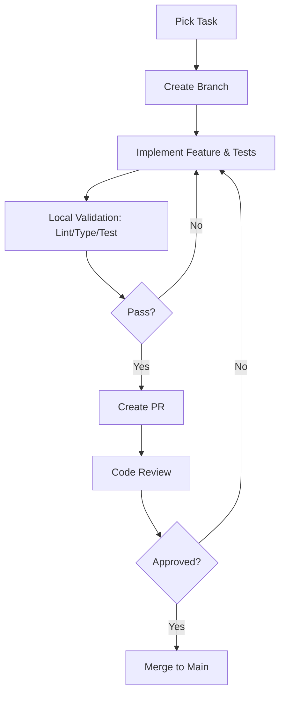
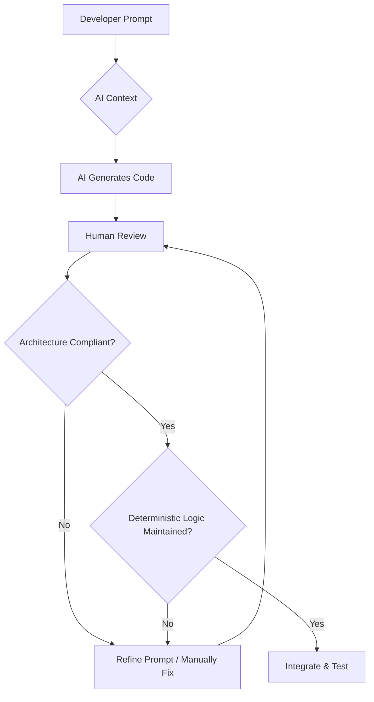

# FIFACoOS - Developer Guide

## 1. Document Information
- **Version:** 1.0
- **Status:** Active
- **Author:** Principal Software Engineer / Code Quality Lead
- **Target Audience:** All developers, engineers, and AI coding assistants contributing to FIFACoOS.

## 2. Purpose
This document serves as the authoritative operational handbook for the FIFACoOS project. It defines exactly *how* the project is developed. While architecture documents explain the *what* and *why*, this guide establishes the standard operating procedures, coding conventions, and quality expectations that every developer (human and AI) must follow throughout implementation. 

## 3. Relationship to Architecture Documents
This Developer Guide is subordinate to and governed by the frozen architecture documents (`ARCHITECTURE.md`, `SYSTEM_DESIGN.md`, `AI_ARCHITECTURE.md`, `TECHNOLOGY_DECISIONS.md`, etc.). It does not make architectural decisions; it enforces them. If a guideline here conflicts with the frozen architecture, the architecture document takes precedence.

## 4. Engineering Philosophy
- **Architecture First:** The agreed-upon architecture is non-negotiable. Code must map cleanly to the established domain models and boundaries.
- **Server-First Development:** Default to server-side execution. Next.js Server Components and Server Actions are the primary means of rendering and mutating data. Opt-in to client-side logic only when absolutely necessary for interactivity.
- **Vertical Slice Development:** Build complete features end-to-end (Database -> Backend -> UI) rather than horizontal layers. This ensures features are immediately testable and usable.
- **Feature-Based Development:** Organize code by business domain (e.g., "wayfinding", "incidents") rather than by technical type, maximizing cohesion and discoverability.
- **Documentation as Code:** Living documentation must reside in the repository and evolve alongside the codebase. 
- **Accessibility by Design:** Accessibility is not an afterthought. Every UI component must be accessible (keyboard navigation, screen readers, contrast) from the first commit.
- **Security by Default:** Zero-trust principles apply everywhere. Always validate inputs, enforce Row-Level Security, and handle secrets appropriately.
- **AI as Decision Support:** AI is a tool to accelerate development, not a replacement for engineering rigor. All AI outputs must be validated, deterministic fallbacks provided, and business logic strictly separated from generative models.
- **Deterministic Business Logic:** Core application state, math, routing, and access control must remain 100% deterministic. Never rely on an LLM for critical application logic.
- **Readable Over Clever:** Write code for the next developer to read. Optimize for clarity and maintainability over extreme brevity.
- **Small Incremental Changes:** Merge small, focused, atomic pull requests to reduce risk and simplify code review.

## 5. Developer Responsibilities
- Adhere strictly to the coding standards and architectural boundaries.
- Write tests for every feature.
- Ensure accessibility and security requirements are met for every commit.
- Update documentation when making significant changes.
- Effectively manage and validate AI-assisted code generation.
- Leave the codebase cleaner than you found it.

---

## 6. Repository Organization
The repository follows a feature-based modular monolith structure. 

- `src/` or Root: Next.js standard directories.
- `app/`: Next.js App Router definitions. Contains pages, layouts, route handlers, and server-side entry points. *Ownership: Frontend / Routing.*
- `components/`: Reusable UI components.
  - `components/ui/`: Primitive, domain-agnostic components (shadcn/ui, buttons, inputs).
  - `components/shared/`: Complex components used across multiple domains.
- `features/`: The core of the application. Organized by domain (e.g., `features/incidents`, `features/wayfinding`). Each feature contains its own domain-specific components, hooks, utilities, and services. *Ownership: Feature Teams/Domain.*
- `lib/`: Application-wide utilities, configurations, and core setup (e.g., Prisma client, Supabase client, shared validation helpers). *Ownership: Core Engineering.*
- `services/`: Shared business logic and external integrations that span multiple features.
- `hooks/`: Global React hooks. (Feature-specific hooks go in `features/`).
- `types/`: Global TypeScript definitions. (Feature-specific types go in `features/`).
- `public/`: Static assets (images, icons, fonts).
- `docs/`: All project documentation, architecture records, and this guide.
- `tests/`: End-to-end and global integration tests. (Unit tests should be co-located with code).
- `scripts/`: Build, database seeding, and deployment scripts.

### Folder Organization Rules
- **Shared code** belongs in `components/ui/`, `components/shared/`, or `lib/`.
- **Business logic** belongs in `features/<domain>/services/` or `features/<domain>/actions/`. Keep it out of UI components.
- **AI logic** belongs in dedicated services (e.g., `features/ai/`) and must be isolated from UI rendering.
- **Database code** belongs in Prisma schemas and isolated data access layer functions within `features/` or `services/`. Do not write raw queries in UI components.
- **UI components** belong in `features/<domain>/components/` if domain-specific, or `components/` if generic.
- **Utilities** belong in `lib/utils.ts` if global, or `features/<domain>/utils/` if specific.
- Avoid duplication by extracting genuinely shared logic to `lib/` or `components/shared/`, but prefer slight duplication over premature abstraction.

---

## 7. Naming Conventions
Consistency is critical for maintainability.

- **Files & Folders:** `kebab-case`. Examples: `user-profile.tsx`, `features/incident-management/`.
- **Variables & Functions:** `camelCase`. Examples: `incidentReport`, `fetchUserData()`.
- **React Components:** `PascalCase`. Examples: `UserProfile`, `IncidentDashboard`.
- **Hooks:** `camelCase` starting with `use`. Examples: `useAuth`, `useIncidentData`.
- **Types & Interfaces:** `PascalCase`. Do not prefix with `I` or `T`. Examples: `User`, `IncidentReport`.
- **Enums:** `PascalCase` for the enum name, `UPPER_SNAKE_CASE` for members. Examples: `enum UserRole { ADMIN, FAN }`.
- **Constants:** `UPPER_SNAKE_CASE`. Examples: `MAX_RETRY_COUNT`, `API_TIMEOUT_MS`.
- **Database Models (Prisma):** `PascalCase` singular. Examples: `model User`, `model Incident`.
- **API Actions / Server Actions:** `camelCase`, typically verb-first. Examples: `createIncident`, `updateUserProfile`.

---

## 8. Import Conventions
- **Absolute Imports:** Always use absolute imports configured via path aliases. Never use complex relative paths (`../../../`).
- **Path Aliases:** Use `@/` for the `src` or root directory. 
  - `import { Button } from '@/components/ui/button'`
  - `import { createIncident } from '@/features/incidents/actions'`
- **Import Ordering:** 
  1. Standard library / Framework imports (e.g., `react`, `next`)
  2. Third-party packages (e.g., `zod`, `lucide-react`)
  3. Absolute internal imports (`@/...`)
  4. Relative imports (only for co-located files like CSS or local components)
- **Avoiding Circular Dependencies:** Keep the dependency graph unidirectional. Features can import from `lib` and `components`, but `lib` and `components` should not import from `features`.
- **Barrel Exports (`index.ts`):** 
  - *When to use:* To expose a clean public API for a module (e.g., exporting specific hooks and components from a `feature/`).
  - *When not to use:* Do not create massive global barrel files that re-export everything; this breaks tree-shaking and causes circular dependency nightmares.

---

## 9. Coding Standards

- **Strict TypeScript:** Enable `strict: true`. Avoid implicit any, strict null checks are mandatory.
- **Avoid `any`:** `any` disables the type system. Use `unknown` for truly unknown data and type guard it, or explicitly define the expected type.
- **Pure Functions:** Prefer pure functions for business logic. They are easier to test and reason about.
- **Single Responsibility Principle (SRP):** A function, component, or file should have one reason to change. If a file exceeds 300 lines, it likely violates SRP.
- **Composition:** Build complex UIs by composing small, single-responsibility components rather than creating monolithic, prop-heavy components.
- **Error Handling:** Use `try/catch` for async operations. Always provide meaningful error messages and log errors appropriately. Use Next.js Error Boundaries for UI fallbacks.
- **Validation:** All inputs (API endpoints, Server Actions, forms) and LLM outputs MUST be validated using Zod schemas. Never trust client data or AI generation.
- **Comments:** Code should be self-documenting through clear naming. Use comments to explain *why* something is done, not *what* is done (unless the logic is necessarily complex). Use JSDoc for public APIs and complex functions.
- **Magic Numbers/Strings:** Extract literal numbers and strings with domain meaning into named constants.
- **Configuration:** Keep environment-specific settings in `.env` files. Validate env variables at startup (e.g., using `t3-env`).

---

## 10. Next.js Guidelines

- **Server Components (RSC):** The default. Use for data fetching, rendering static UI, and SEO. They reduce client bundle size and improve performance.
- **Client Components:** Opt-in using `"use client"`. Use *only* when interactivity is required (e.g., `useState`, `useEffect`, event listeners, browser APIs).
- **Server Actions:** Use for data mutations (POST, PUT, DELETE). They provide secure, RPC-like endpoints directly in the framework. Always validate inputs inside the action.
- **Route Handlers (`api/...`):** Use for external API endpoints, webhooks, or when streaming non-UI data is required. Prefer Server Actions for internal mutations.
- **Metadata:** Define metadata export in `layout.tsx` or `page.tsx` for SEO and social sharing.
- **Loading UI:** Utilize `loading.tsx` to display instant loading states while Server Components resolve.
- **Error Boundaries:** Use `error.tsx` to gracefully catch rendering errors and prevent the entire application from crashing.
- **Streaming:** Wrap slow data-fetching components in `<Suspense>` to stream the UI progressively.
- **Caching Boundaries:** Understand Next.js caching. Explicitly manage caching behavior (e.g., `revalidatePath`, `no-store`) based on data volatility.

---

## 11. AI Development Guidelines

AI is a core feature, but it must be heavily constrained.

- **Never trust LLM output:** LLMs hallucinate. 
- **Always validate:** Every JSON output from an LLM must be parsed and validated through a Zod schema before being used by the application.
- **Keep prompts deterministic:** Inject clear, factual context into prompts. Limit the LLM's freedom to invent facts.
- **Separate prompts from business logic:** Prompts belong in dedicated AI services, not embedded inside UI components or core business functions.
- **Log AI failures:** Track validation failures and prompt errors to improve the system over time.
- **Always provide deterministic fallbacks:** If the AI fails, times out, or generates invalid data, the system must degrade gracefully with a predefined, deterministic response.
- **AI Development Philosophy:** Use AI as a flexible natural language interface and summarization engine, layered *on top* of a rock-solid, traditional, deterministic application architecture.

---

## 12. Database Guidelines (Prisma & Supabase)

- **Prisma Usage:** Use Prisma as the primary ORM for type-safe database access. Maintain the `schema.prisma` as the single source of truth for the domain model.
- **Transactions:** Use Prisma transactions `$transaction` when multiple writes must succeed or fail together to maintain data integrity.
- **Migrations:** Never modify the database directly. Always use Prisma migrations (`prisma migrate dev`).
- **RLS Awareness:** Prisma queries run with a service role context by default on the backend. When implementing user-facing queries, ensure you are either passing the user context to Supabase securely or explicitly applying authorization checks *before* querying Prisma, as Prisma does not enforce Supabase RLS policies directly. 
- **Data Validation:** Validate data *before* it hits the database (using Zod in Server Actions) and rely on database constraints (foreign keys, unique indexes) as the final defense.
- **Query Organization:** Encapsulate database queries in service files (e.g., `features/users/user.service.ts`). Do not write Prisma queries directly inside React components.
- **Avoiding N+1:** Use Prisma's `include` carefully. For complex relational data, ensure you are fetching efficiently and not causing N+1 query problems in loops.

---

## 13. Security Guidelines

- **Secrets:** Never commit secrets to version control. Use `.env` files locally and secure environment variables in production.
- **Authentication:** All protected routes and Server Actions must verify the user's session.
- **Authorization:** Implement Role-Based Access Control (RBAC). Verify the user has the correct role (`Fan`, `Volunteer`, `Ops`) before performing sensitive actions.
- **Input/Output Validation:** As stated, use Zod for all boundaries.
- **PII:** Be extremely cautious with Personally Identifiable Information. Strip PII before sending context to the AI provider.
- **Logging:** Do not log sensitive user data, passwords, or full AI prompts containing PII.
- **Least Privilege:** Services, database roles, and API keys should only have the permissions strictly necessary for their function.
- **Dependency Updates:** Keep dependencies updated to patch known vulnerabilities.

---

## 14. Accessibility Guidelines

- **Accessibility by Design:** Target WCAG 2.1 AA compliance.
- **Keyboard Navigation:** Every interactive element must be reachable and actionable via the `Tab` and `Enter/Space` keys.
- **ARIA:** Use ARIA attributes appropriately to describe complex widgets to screen readers, but prefer semantic HTML when possible.
- **Focus Management:** Manage focus intuitively, especially for modals, dialogs, and dynamic AI responses. Focus must never be trapped.
- **Semantic HTML:** Use `<button>`, `<a>`, `<nav>`, `<main>`, `<header>` instead of `<div>` where appropriate.
- **Color Contrast:** Ensure text has sufficient contrast against its background.
- **Forms:** All inputs must have associated `<label>` elements. Clearly announce validation errors to screen readers.
- **Tooling:** Use `eslint-plugin-jsx-a11y` and rely on headless UI primitives (like Radix UI via shadcn) that handle complex accessibility requirements internally.

---

## 15. Testing Expectations

For every feature, the following testing tiers are expected:
- **Unit Tests:** Test pure functions, complex domain logic, utilities, and validation schemas in isolation.
- **Integration Tests:** Test the interaction between Server Actions and the database, and complex UI component compositions.
- **Accessibility Tests:** Automated checks (e.g., axe-core) integrated into the testing pipeline.
- **AI Validation:** Test that the AI service correctly handles valid/invalid LLM outputs and triggers fallbacks appropriately. Mock the LLM provider for these tests.
- **Regression Tests:** End-to-end tests for critical user flows (e.g., submitting an incident, logging in) to ensure core functionality remains unbroken.
- **Minimum Expectations:** Code must pass all tests, linting, and type-checking before it can be merged.

---

## 16. Documentation Policy

Documentation must be kept current. Update the appropriate documents when:
- **README changes:** When setup instructions, environment variables, or core commands change.
- **Architecture changes:** When fundamental system boundaries or data flows change (requires an Architecture Decision Record - ADR).
- **Technology Decisions change:** When a new framework, library, or core technology is introduced or replaced.
- **Implementation Plan changes:** When the scope, sequence, or status of major features changes.
- **Changelog updates:** Maintain a `CHANGELOG.md` documenting user-facing changes, fixes, and architectural updates for each release.

---

## 17. Git Workflow

- **Branch Naming:** Use descriptive prefixes: `feat/` (new feature), `fix/` (bug fix), `docs/` (documentation), `chore/` (maintenance), `refactor/` (code restructuring). Example: `feat/incident-reporting`.
- **Commit Messages:** Follow conventional commits format: `type(scope): description`. Example: `feat(incidents): add file upload support to reports`.
- **Atomic Commits:** Keep commits small and focused on a single logical change. Do not mix formatting changes with feature logic.
- **PR Expectations:** Pull Requests should be small, reviewable, and linked to an issue or feature requirement.
- **Merge Strategy:** Squash and merge feature branches into `main` to maintain a clean, linear history.
- **Tagging:** Use semantic versioning (v1.0.0) for releases.

---

## 18. AI Collaboration Rules (SOP)

This section defines the Standard Operating Procedure for developers collaborating with AI coding assistants.

- **Reference Existing Documents:** Always direct the AI to read the frozen architecture and design documents (`ARCHITECTURE.md`, `TECHNOLOGY_DECISIONS.md`, etc.) before starting a task.
- **Do Not Redesign Architecture:** AI assistants must not unilaterally change the architecture, data models, or technology stack. If a change seems necessary, the AI must flag it for human review and request an ADR.
- **Maintain Naming Consistency:** Instruct the AI to follow the exact naming conventions defined in this guide.
- **Request Incremental Changes:** Ask the AI to build features step-by-step (e.g., "Build the Zod schema first", "Now build the Server Action", "Now build the UI"). Avoid asking for a massive, multi-file feature in a single prompt.
- **Require Explanations:** When the AI generates complex logic, require it to explain *why* it chose that approach.
- **Validate Generated Code:** The human developer is ultimately responsible for the code. Always review the AI's output for logical flaws, security vulnerabilities, and adherence to standards.
- **Review Security Implications:** Explicitly verify that the AI has not introduced security flaws (e.g., SQL injection, bypassing RLS, exposing secrets).
- **Review Accessibility:** Ensure the AI generated semantic HTML and appropriate ARIA attributes.
- **Review Performance:** Check for N+1 queries or unnecessary client-side rendering in the AI's output.
- **Preserve Deterministic Logic:** Strictly prohibit the AI from replacing deterministic application state or routing logic with generative AI calls.

---

## 19. Code Review Checklist

Before approving a PR, reviewers must verify:
- [ ] **Architecture Compliance:** Does this code align with the established boundaries and design patterns?
- [ ] **Naming:** Do files, variables, and components follow conventions?
- [ ] **Testing:** Are there adequate tests? Do they pass?
- [ ] **Accessibility:** Are UI components keyboard-navigable and screen-reader friendly?
- [ ] **Security:** Is input validated? Are permissions checked? Is data handled safely?
- [ ] **Performance:** Are there obvious bottlenecks (e.g., unnecessary re-renders, slow queries)?
- [ ] **Documentation:** Have relevant docs or comments been updated?
- [ ] **Error Handling:** Are exceptions caught and handled gracefully?
- [ ] **Maintainability:** Is the code clean, readable, and DRY?

---

## 20. Pull Request Checklist

Authors must include and complete this checklist in their PR descriptions:
```markdown
- [ ] I have read and followed the `DEVELOPER_GUIDE.md`.
- [ ] I have added/updated tests for my changes.
- [ ] I have verified the UI changes for accessibility (keyboard, contrast).
- [ ] I have run `npm run lint` and `npm run typecheck` and resolved all errors.
- [ ] I have verified that this change does not break deterministic business logic.
- [ ] I have documented any new environment variables or setup steps.
```

---

## 21. Definition of Done (DoD)

A feature is considered "Done" when:
- **Code Complete:** The feature meets all acceptance criteria.
- **Tests Passing:** Unit, integration, and E2E tests pass in the CI pipeline.
- **Documentation Updated:** Relevant documentation (README, API docs) reflects the new state.
- **Accessibility Verified:** UI meets WCAG guidelines and has been tested for keyboard/screen reader use.
- **Security Reviewed:** Input validation, RBAC, and data privacy are enforced.
- **No Lint/Type Errors:** The build succeeds without warnings or errors.
- **Architecture Preserved:** The implementation aligns perfectly with the frozen architecture documents.

---

## 22. Common Anti-Patterns

Avoid these practices; they will be flagged during code review.
- **Business Logic inside Components:** *Why:* Makes components hard to test and re-use. Extract logic to hooks or services.
- **Large Files (>300 lines):** *Why:* Hard to read, navigate, and maintain. Violates SRP. Break them down.
- **Copy-Paste Code:** *Why:* Creates maintenance nightmares. Extract into shared utilities or components.
- **Hidden State:** *Why:* Makes data flow unpredictable. Elevate state or use clear state management patterns.
- **Overusing `useEffect`:** *Why:* Often leads to race conditions and unnecessary re-renders. Prefer derived state or Server Components.
- **Ignoring Validation:** *Why:* A massive security and stability risk. Always use Zod at boundaries.
- **Ignoring Accessibility:** *Why:* Excludes users and violates project requirements. It's harder to retrofit later.
- **Using `any`:** *Why:* Defeats the purpose of TypeScript and hides potential runtime crashes.
- **Mixing Concerns:** *Why:* E.g., querying the database directly inside a UI component. Blurs architectural boundaries and hinders testing.

---

## 23. Onboarding Checklist

Welcome to the team! Follow these steps to get started:
1. [ ] **Read the Architecture:** Review `ARCHITECTURE.md` and `SYSTEM_DESIGN.md` to understand the big picture.
2. [ ] **Read the Implementation Plan:** Review `IMPLEMENTATION_PLAN.md` to understand current priorities.
3. [ ] **Review this Guide:** Read this `DEVELOPER_GUIDE.md` thoroughly.
4. [ ] **Setup Environment:** Install Node.js, pnpm, and Docker (if needed for local DB). Copy `.env.example` to `.env` and configure secrets.
5. [ ] **Understand Folder Structure:** Explore `src/` to familiarize yourself with the domain-based organization.
6. [ ] **Run the Project:** Execute `pnpm install` then `pnpm dev` and ensure the app loads locally.
7. [ ] **Run Tests:** Execute `pnpm test` to verify your local environment is sound.
8. [ ] **Review AI Guidelines:** Read section 18 to understand how to effectively use AI tools on this project.

---

## 24. Mermaid Diagrams

### Development Workflow


### AI Code Generation Flow


---

## 25. Executive Summary

- **Engineering Philosophy:** We build for quality, determinism, and maintainability. Architecture constraints are non-negotiable.
- **Most Important Rules:** Strictly separate UI from business logic. Always validate data at the boundaries using Zod. Never trust generative AI for core application state.
- **AI Collaboration:** AI is an accelerator, not an architect. Guide it carefully, review its output relentlessly, and ensure it follows our standard operating procedures.
- **Developer Expectations:** Write clean, typed, accessible, and tested code. Leave the codebase better than you found it.
- **Quality Expectations:** Zero tolerance for type errors, unhandled exceptions, or accessibility violations in the `main` branch.
- **Readiness:** With this guide established, the team is fully aligned on standard operating procedures. Implementation may commence immediately.
