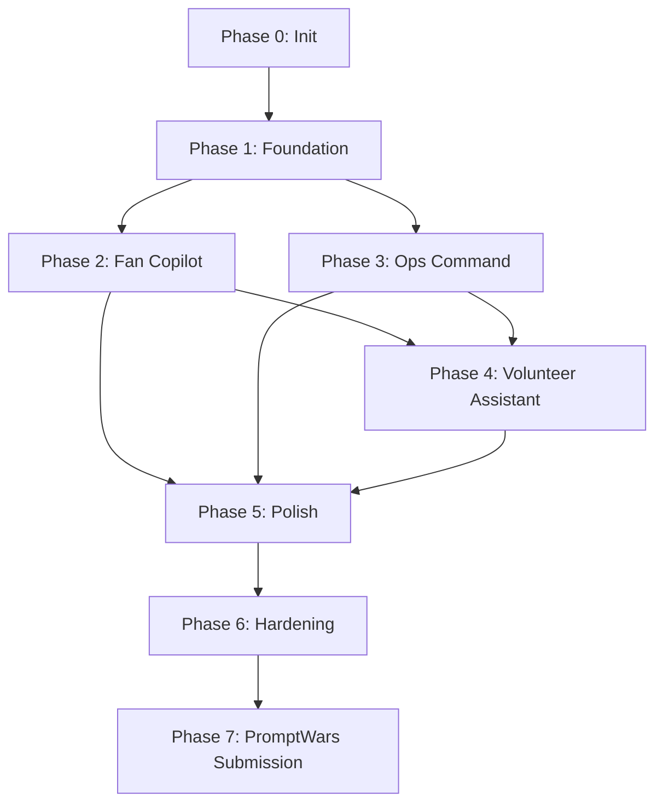

# FIFACoOS - Phase Checklists & Execution Tracker

## 1. Document Information

- **Version:** 1.0
- **Status:** Active (Living Document)
- **Target Audience:** All developers, engineering managers, and QA leads.
- **Depends On:** `IMPLEMENTATION_PLAN.md`, `DEVELOPER_GUIDE.md`

## 2. Purpose

This document is the daily operational execution tracker for the FIFACoOS project. It translates the high-level roadmap into measurable, daily engineering tasks, quality gates, and release checklists. It serves as a combined Sprint board, Definition of Done, and engineering playbook.

## 3. Relationship to IMPLEMENTATION_PLAN.md

- **`IMPLEMENTATION_PLAN.md`** answers: _What are we building, and in what order?_ (Strategy & Roadmap)
- **`PHASE_CHECKLISTS.md`** answers: _What exactly do I need to do today to finish this phase safely?_ (Tactics & Execution)
  Do not duplicate the 'why' or the high-level features from the implementation plan; focus purely on the operational _how_ and _done criteria_.

## 4. How To Use This Document

1. **Morning:** Review the Progress Tracker and Daily Progress Log.
2. **Development:** Check off specific items in the active Phase Checklist.
3. **Completion:** Verify all Quality Gates and Self-Reviews are passed before marking a phase complete.
4. **Always:** Treat this as a living document. Update statuses manually as work progresses.

---

## 5. Progress Tracker

| Phase                      | Status      | Started    | Completed | Owner    | Notes                           | Risk   |
| :------------------------- | :---------- | :--------- | :-------- | :------- | :------------------------------ | :----- |
| **0:** Repository Init     | In Progress | 2026-07-13 |           | Solo Dev | Prompt 1+2 complete             | Low    |
| **1:** Platform Foundation | Not Started |            |           | Solo Dev | Core shared layers              | Medium |
| **2:** Fan Copilot         | Not Started |            |           | Solo Dev | Critical MVP slice              | High   |
| **3:** Ops Command Center  | Not Started |            |           | Solo Dev | Dashboard & RBAC                | Medium |
| **4:** Volunteer Assistant | Not Started |            |           | Solo Dev | Deterministic Knowledge Service | Medium |
| **5:** Polish              | Not Started |            |           | Solo Dev | UI/UX & A11y                    | Low    |
| **6:** Hardening           | Not Started |            |           | Solo Dev | Security & Perf                 | High   |
| **7:** PromptWars Submit   | Not Started |            |           | Solo Dev | Packaging                       | Medium |

---

## 6. Mermaid Diagrams

### Overall Phase Timeline

```mermaid
gantt
    title FIFACoOS Implementation Timeline
    section Setup
    Phase 0: Init           :a1, 1d
    Phase 1: Foundation     :a2, after a1, 3d
    section Core
    Phase 2: Fan Copilot    :a3, after a2, 5d
    Phase 3: Ops Command    :a4, after a3, 4d
    Phase 4: Volunteer      :a5, after a4, 3d
    section Finalization
    Phase 5: Polish         :a6, after a5, 2d
    Phase 6: Hardening      :a7, after a6, 2d
    Phase 7: Submission     :a8, after a7, 1d
```

### Phase Dependencies



### Feature Completion Flow


---

## 7. Phase Checklists

### PHASE 0: Repository Initialization

- **Objective:** Establish a robust, secure, and typed foundation that enforces code quality automatically.
- **Dependencies:** None.
- **Architecture References:** `TECHNOLOGY_DECISIONS.md`
- **Deliverables:** Configured Next.js project, database connection, CI pipeline.
- **Estimated Complexity:** Low | **Estimated Effort:** 1 Day | **Risk Level:** Low

**Task Checklist:**

- [x] Repository initialized (Git)
- [ ] Branch protection configured (`main` locked)
- [x] Next.js initialized (App Router)
- [x] TypeScript configured (`strict: true`)
- [x] Tailwind CSS configured
- [x] shadcn/ui configured
- [ ] Supabase connected (Project created, Keys verified)
- [x] Prisma initialized (Schema baseline)
- [ ] Environment variables validated (using `t3-env` or Zod)
- [x] ESLint configured
- [x] Prettier configured
- [x] Husky configured (pre-commit hooks)
- [x] lint-staged configured
- [x] Vitest installed
- [x] Playwright installed
- [ ] CI pipeline configured (GitHub Actions)
- [x] README updated with setup instructions
- [ ] Folder structure verified against `DEVELOPER_GUIDE.md`
- [x] Architecture documents linked
- [x] Developer Guide reviewed
- [ ] Phase approved

**Cross-Discipline Checklists:**

- [ ] **Testing:** Verify CI runs empty test suite successfully.
- [ ] **Accessibility:** ESLint `jsx-a11y` plugin active.
- [x] **Security:** `.env` added to `.gitignore`. Secrets not hardcoded.
- [x] **Documentation:** README updated with local setup instructions.

**Common Risks & Mitigation:**

- _Risk:_ Over-engineering config. _Mitigation:_ Stick strictly to standard Next.js templates.
- _AI Mistake:_ Generating outdated Next.js config files.
- _Recovery/Rollback criteria:_ Delete config and re-run standard `npx` init scripts.

**Exit Criteria & Quality Gate:**

- [x] `npm run dev` starts without errors.
- [x] `npm run typecheck` passes.
- [x] `npm run lint` passes.

**Developer Self Review:**

- [ ] Architecture respected
- [ ] Naming conventions followed
- [ ] Environment documented
- [ ] Ready for merge

---

### PHASE 1: Platform Foundation

- **Objective:** Build shared primitives, routing shells, and authentication baseline.
- **Dependencies:** Phase 0
- **Architecture References:** `SYSTEM_DESIGN.md` (Application Layer)
- **Deliverables:** Root layouts, Auth integration, Base UI components.
- **Estimated Complexity:** Medium | **Estimated Effort:** 3 Days | **Risk Level:** Medium

**Task Checklist:**

- [ ] Design System tokens established
- [ ] Root Layouts (Fan, Ops, Volunteer)
- [ ] Routing shell created
- [ ] Supabase Authentication implemented
- [ ] Shared Components generated (Buttons, Inputs, Cards)
- [ ] Theme configuration (Dark/Light mode)
- [ ] Validation schemas (Zod) base setup
- [ ] Global Error Boundaries setup
- [ ] Base `lib/utils` populated
- [ ] Environment configuration verified

**Cross-Discipline Checklists:**

- [ ] **Testing:** Auth flow unit tests passing.
- [ ] **Accessibility:** All shared UI components keyboard-navigable.
- [ ] **Security:** Next.js middleware checking Auth cookies.
- [ ] **Documentation:** Shared components documented.

**Common Risks & Mitigation:**

- _Risk:_ Auth blocking server rendering. _Mitigation:_ Use Supabase SSR package correctly.
- _AI Mistake:_ Creating custom UI instead of using shadcn/ui primitives.
- _Architecture violation:_ Placing sensitive checks on the client.

**Exit Criteria & Quality Gate:**

- [ ] User can log in and log out securely.
- [ ] Unauthenticated users are redirected properly.

**Developer Self Review:**

- [ ] Security checked (Auth middleware)
- [ ] Tests written
- [ ] Accessibility checked

---

### PHASE 2: Fan Copilot Vertical Slice

- **Objective:** Deliver the primary conversational interface and core MVP value.
- **Dependencies:** Phase 1
- **Architecture References:** `AI_ARCHITECTURE.md`, `PRD.md`
- **Deliverables:** Conversational UI, AI integrations, mapping, telemetry fallback.
- **Estimated Complexity:** High | **Estimated Effort:** 5 Days | **Risk Level:** High

**Task Checklist:**

- [ ] Navigation components
- [ ] Conversational Chat Interface UI
- [ ] Knowledge Retrieval Service (Deterministic)
- [ ] Vercel AI SDK integration (Gemini)
- [ ] AI Structured Responses (Zod)
- [ ] Multilingual support placeholder/integration
- [ ] Mapbox GL JS integration
- [ ] Wait Time/Telemetry frontend bindings
- [ ] Fallbacks (Deterministic UI when AI fails)
- [ ] Validation logic integration
- [ ] Testing setup for conversational flow
- [ ] End-to-end Demo recorded
- [ ] Documentation updated

**Cross-Discipline Checklists:**

- [ ] **Testing:** LLM fallback logic mocked and tested.
- [ ] **Accessibility:** Chat UI announces new messages to screen readers.
- [ ] **Security:** Prompt sanitization strips fake PII.
- [ ] **AI:** System prompt carefully tuned and deterministic bounds enforced.

**Common Risks & Mitigation:**

- _Risk:_ LLM hallucinating directions. _Mitigation:_ Strict Zod validation; fallback to DB queries.
- _AI Mistake:_ Generating non-streaming standard fetch calls for AI instead of approved AI SDK chat abstraction.

**Exit Criteria & Quality Gate:**

- [ ] AI correctly streams responses.
- [ ] Invalid JSON from AI triggers safe fallback.

**Developer Self Review:**

- [ ] AI reviewed and output strictly validated
- [ ] Accessibility checked (ARIA live regions)
- [ ] Performance checked (Streaming works)

---

### PHASE 3: Operations Command Center

- **Objective:** Provide the deterministic, data-heavy dashboard for staff.
- **Dependencies:** Phase 1 (and potentially Phase 2 telemetry structures)
- **Architecture References:** `SECURITY.md`, `DATABASE_SCHEMA.md`
- **Deliverables:** Dashboard UI, Incident management, telemetry viz.
- **Estimated Complexity:** Medium | **Estimated Effort:** 4 Days | **Risk Level:** Medium

**Task Checklist:**

- [ ] Ops Dashboard Layout
- [ ] Incident Reporting Forms (Staff side)
- [ ] Incident Timeline visualization
- [ ] AI Recommendations (Summarization of incidents)
- [ ] Decision Support UI
- [ ] Telemetry Visualization (Simulated data graphs)
- [ ] Authentication enforcement
- [ ] RBAC enforcement (Ops role only)
- [ ] Audit Trail logging
- [ ] Testing of incident creation

**Cross-Discipline Checklists:**

- [ ] **Testing:** Integration tests for Incident creation.
- [ ] **Accessibility:** Data tables are readable by screen readers.
- [ ] **Security:** Supabase RLS policies strictly applied to incident tables.

**Common Risks & Mitigation:**

- _Risk:_ Data leakage to fans. _Mitigation:_ RLS policies must be bulletproof.
- _AI Mistake:_ Writing Prisma queries in Client Components.

**Exit Criteria & Quality Gate:**

- [ ] RLS prevents Fans from reading Ops tables.
- [ ] Incident creation persists deterministically.

**Developer Self Review:**

- [ ] Security checked (RLS)
- [ ] Architecture respected (Server Actions used)
- [ ] Documentation updated

---

### PHASE 4: Volunteer Assistant

- **Objective:** Provide mobile-optimized, policy-aware tools for volunteers.
- **Dependencies:** Phase 2, Phase 3
- **Architecture References:** `PRD.md`
- **Deliverables:** FAQs, Policy retrieval, localized AI chat.
- **Estimated Complexity:** Medium | **Estimated Effort:** 3 Days | **Risk Level:** Medium

**Task Checklist:**

- [ ] Volunteer Mobile Layout
- [ ] Knowledge Service context retrieval
- [ ] Policies & FAQs UI
- [ ] Semantic/Deterministic Search integration
- [ ] Volunteer AI Chat interface
- [ ] Localization (if separate from Fan context)
- [ ] Testing role boundaries

**Cross-Discipline Checklists:**

- [ ] **Testing:** Role-based context injection verified.
- [ ] **Accessibility:** High contrast for outdoor mobile use.
- [ ] **AI:** Prompt distinguishes volunteer privileges from fan privileges.

**Common Risks & Mitigation:**

- _Risk:_ Volunteer seeing Ops-level sensitive data. _Mitigation:_ Strict RLS and prompt context separation.

**Exit Criteria & Quality Gate:**

- [ ] Volunteer successfully retrieves specific policies via Copilot.

**Developer Self Review:**

- [ ] Security checked
- [ ] Mobile responsiveness verified
- [ ] Ready for merge

---

### PHASE 5: Polish

- **Objective:** Ensure production-level UI/UX quality.
- **Dependencies:** Phases 2, 3, 4
- **Architecture References:** `DEVELOPER_GUIDE.md` (Accessibility, Polish)
- **Estimated Complexity:** Low | **Estimated Effort:** 2 Days | **Risk Level:** Low

**Task Checklist:**

- [ ] Complete Accessibility audit (axe-core)
- [ ] Finalize Localization strings
- [ ] Performance check (Lighthouse)
- [ ] Responsive Design sweep (Mobile/Tablet/Desktop)
- [ ] Error Handling refinement (Toasts, Error Boundaries)
- [ ] Offline Behaviour / Graceful degradation
- [ ] Loading States (Skeletons)

**Developer Self Review:**

- [ ] Accessibility verified
- [ ] Performance checked
- [ ] No visual regressions

---

### PHASE 6: Hardening

- **Objective:** Eliminate security, performance, and stability risks before submission.
- **Dependencies:** Phase 5
- **Architecture References:** `SECURITY.md`, `TESTING_STRATEGY.md`
- **Estimated Complexity:** High | **Estimated Effort:** 2 Days | **Risk Level:** High

**Task Checklist:**

- [ ] Security review (Pen-test RLS policies)
- [ ] Performance tuning (Caching boundaries)
- [ ] Full Regression test sweep
- [ ] Accessibility Audit
- [ ] Deep AI Validation (Stress testing prompt injections)
- [ ] API Rate limiting / Stress testing simulated endpoints
- [ ] Final Bug Fixes

**Developer Self Review:**

- [ ] Security verified
- [ ] Tests passing
- [ ] AI reviewed

---

### PHASE 7: PromptWars Submission

- **Objective:** Package the project flawlessly for the competition judges.
- **Dependencies:** Phase 6
- **Estimated Complexity:** Medium | **Estimated Effort:** 1 Day | **Risk Level:** Low

**Task Checklist:**

- [ ] Final Demo recorded/tested
- [ ] Screenshots captured
- [ ] `README.md` finalized
- [ ] Architecture consistency verified (Docs match Code)
- [ ] Submission Video exported
- [ ] Deployment working (Vercel)
- [ ] E2E tests passing on deployed URL
- [ ] Submission package compiled

**Developer Self Review:**

- [ ] Ready for merge/submission
- [ ] PromptWars requirements satisfied

---

## 8. Cross-Phase Quality Gates

Mandatory gates before any phase can be marked `Completed`:

- [ ] No TypeScript errors (`tsc --noEmit`).
- [ ] No lint errors (`eslint`).
- [ ] All Unit & Integration tests passing.
- [ ] Accessibility passing (automated checks).
- [ ] Security review completed (RLS and Env Vars).
- [ ] Documentation updated to reflect reality.
- [ ] Architecture boundaries preserved.
- [ ] Performance acceptable (no obvious regressions).

---

## 9. Daily Progress Tracking

### Daily Progress Log (Template)

Copy this block to log your daily momentum in a scratchpad or comments:

```text
**Date:** YYYY-MM-DD
**Goal:** [What vertical slice are you building?]
**Completed:** [What actually got done?]
**Issues:** [Blockers or AI hallucinations encountered]
**Next Steps:** [Task for tomorrow]
**Documentation Updated?:** Yes/No
**Tests Passing?:** Yes/No
```

### Weekly Review Template (Template)

```text
**Week:** [Week Number/Date]
**Completed Features:** [List]
**Technical Debt:** [What needs refactoring later?]
**Open Risks:** [Security, Performance, Missing specs]
**Blocked Items:** [What is holding up progress?]
**Architecture Changes:** [Did anything shift?]
**ADR Required?:** Yes/No
```

---

## 10. Final Project Checklist (Pre-Submission)

Before submitting to PromptWars, verify the following:

- [ ] Architecture fully preserved.
- [ ] Implementation complete per Phase 7.
- [ ] All tests passing locally and in CI.
- [ ] Accessibility verified (WCAG 2.1 AA baseline).
- [ ] Security verified (RLS prevents unauthorized reads/writes).
- [ ] Documentation complete (all `.md` files).
- [ ] `README.md` contains clear start instructions.
- [ ] Deployment working on Vercel/Production URL.
- [ ] Demo working flawlessly without code changes.
- [ ] Presentation ready.
- [ ] PromptWars requirements explicitly satisfied.

---

## 11. Engineering Philosophy Reinforcement

Throughout all phases, remember:

- **Small vertical slices:** Ship end-to-end increments.
- **Incremental delivery:** Never build huge dormant feature branches.
- **Continuous testing & documentation:** Do not leave this to Phase 6.
- **Continuous review:** Always self-review against architecture patterns.
- **Architecture preservation:** The architecture is frozen; your code must fit it.
- **AI as assistant, Human ownership:** You own the code; the AI only drafts it.

---

## 12. Summary

1. **Philosophy:** This document treats development as an operational checklist. It is tactical, measurable, and highly disciplined, ensuring quality gates are never bypassed.
2. **Difference from Implementation Plan:** `IMPLEMENTATION_PLAN.md` dictates strategy and sequencing. This document (`PHASE_CHECKLISTS.md`) dictates the daily execution steps, safety rules, and validation gates required to complete that sequence.
3. **Living Document:** This tracker is intended to remain a living document throughout the entire implementation lifecycle. Check boxes and update the progress table daily to maintain momentum and visibility.

========================================================
END OF DOCUMENT
========================================================
