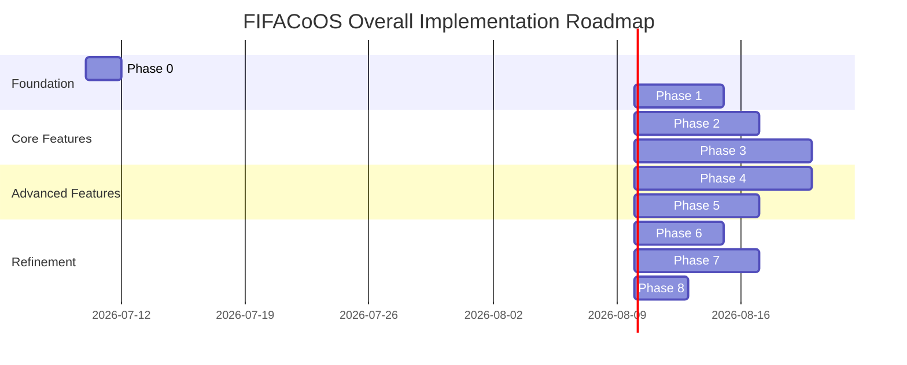
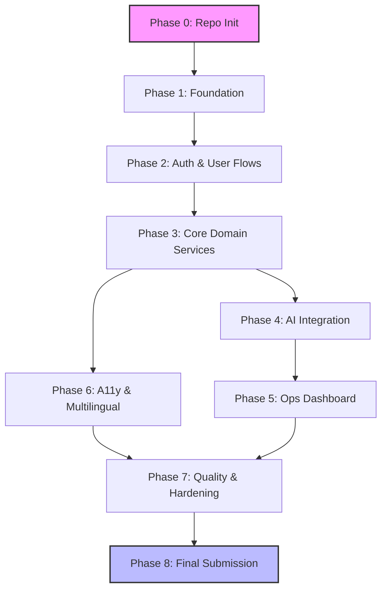
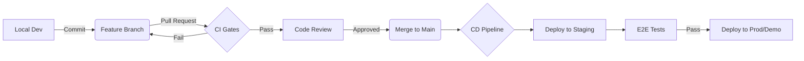

# FIFACoOS Implementation Plan

## 1. Document Information
**Document Name:** Master Implementation Plan
**Version:** 1.0.0
**Phase:** Engineering Roadmap
**Status:** DRAFT (Pending Technology Decisions)
**Roles Assumed:** Technical Program Manager, Principal Software Architect, Engineering Manager, Staff Software Engineer, Release Manager, Technical Writer

## 2. Purpose
This Implementation Plan serves as the master execution roadmap for the FIFACoOS project. It translates the frozen Architecture v1.0 into an actionable, phased engineering strategy, guiding development from repository initialization to the final PromptWars competition submission.

## 3. Relationship to Architecture Documents
The architectural design phase is completed and frozen as Architecture v1.0. This implementation plan strictly adheres to the following authoritative documents:
* `docs/product/PRD.md`
* `docs/architecture/ARCHITECTURE.md`
* `docs/architecture/SYSTEM_DESIGN.md`
* `docs/architecture/AI_ARCHITECTURE.md`
* `docs/architecture/DATABASE_SCHEMA.md`
* `docs/architecture/API_DESIGN.md`
* `docs/architecture/SECURITY.md`
* `docs/architecture/TESTING_STRATEGY.md`

*Note: If implementation work conflicts with the architecture, the conflict must be reported to the architecture board. The design must not be silently altered.*

## 4. Development Philosophy
* **Correctness before optimization:** Build it right, then build it fast.
* **Working vertical slices over isolated components:** Deliver end-to-end functionality as early as possible.
* **Incremental delivery:** Small, frequent, verifiable releases.
* **Continuous testing:** Automated tests validate every commit.
* **Continuous documentation:** Documentation is code and evolves with the implementation.
* **Maintainability:** Code must be readable, modular, and easy to extend.
* **Accessibility:** Inclusive design is not an afterthought; it is integrated from day one.
* **Security by default:** Secure patterns are applied proactively, zero-trust mindset.
* **AI as an integrated subsystem:** AI is treated as a core dependency and first-class citizen, not a bolt-on feature.

## 5. Guiding Engineering Principles
1. Avoid building infrastructure before it is needed.
2. Deliver user-visible functionality as early as possible.
3. Keep pull requests small, atomic, and focused on a single concern.
4. If it's not tested, it's considered broken.
5. Defer technology decisions to the `TECHNOLOGY_DECISIONS.md` phase.

## 6. Overall Roadmap
The roadmap is structured to deliver value incrementally, starting with repository setup, establishing the foundation, and systematically adding vertical slices until final hardening.

---

## 7. Project Phases

### Phase 0: Repository Initialization
* **Objective:** Establish the foundational version control, CI/CD pipelines, and initial project scaffolding.
* **Deliverables:** Git repository, CI/CD workflows, initial folder structure, dependency management setup, and linter/formatter configurations.
* **Features:** None (Developer tooling only).
* **Dependencies:** None.
* **Architecture Docs:** `ARCHITECTURE.md`, `TESTING_STRATEGY.md`
* **Expected Outputs:** A buildable "Hello World" application with passing CI.
* **Testing Requirements:** CI runs successfully on PR creation.
* **Documentation Updates:** `README.md`, `CONTRIBUTING.md`.
* **Definition of Done:** Main branch is protected, CI enforces linting/tests, folder structure matches `SYSTEM_DESIGN.md`.
* **Major Risks:** Paralysis by analysis on initial configuration.
* **Mitigations:** Use standard boilerplate; refine later if necessary.
* **Estimated Complexity:** Low.

### Phase 1: Foundation
* **Objective:** Implement core routing, state management architecture, API client scaffolding, and database connection.
* **Deliverables:** Scaffolded frontend and backend, base database migrations.
* **Features:** Shared UI components library, health check API endpoint.
* **Dependencies:** Phase 0.
* **Architecture Docs:** `SYSTEM_DESIGN.md`, `DATABASE_SCHEMA.md`
* **Expected Outputs:** A deployed shell application with database connectivity.
* **Testing Requirements:** Unit tests for base components, API contract tests for health check.
* **Documentation Updates:** Component guidelines, API documentation setup.
* **Definition of Done:** Frontend shell renders, backend health endpoint returns 200 OK connected to DB.
* **Major Risks:** Integration issues between frontend, backend, and DB.
* **Mitigations:** Focus purely on vertical "Hello World" connection, no business logic yet.
* **Estimated Complexity:** Medium.

### Phase 2: Authentication & User Flows
* **Objective:** Secure the application and implement user identity.
* **Deliverables:** Registration, Login, Password Reset, RBAC implementation, JWT/Session handling.
* **Features:** User authentication, protected routes, basic user profile.
* **Dependencies:** Phase 1.
* **Architecture Docs:** `SECURITY.md`, `API_DESIGN.md`
* **Expected Outputs:** Secure login system with differentiated roles (e.g., Admin, User).
* **Testing Requirements:** Authentication integration tests, security fuzzing on auth endpoints, E2E login flow tests.
* **Documentation Updates:** Auth sequence diagrams, security audit logs.
* **Definition of Done:** Users can securely authenticate; unauthorized access is blocked at API and UI levels.
* **Major Risks:** Security vulnerabilities (XSS, CSRF, Token leakage).
* **Mitigations:** Strict adherence to `SECURITY.md` guidelines, utilize proven Auth provider/libraries.
* **Estimated Complexity:** High.

### Phase 3: Core Domain Services
* **Objective:** Implement the primary business logic for FIFACoOS.
* **Deliverables:** CRUD operations for core domain entities (e.g., Tournaments, Teams, Players, Matches).
* **Features:** Dashboard layouts, data tables, forms for entity management.
* **Dependencies:** Phase 2.
* **Architecture Docs:** `DATABASE_SCHEMA.md`, `API_DESIGN.md`, `PRD.md`
* **Expected Outputs:** Functional application where users can manage core data points.
* **Testing Requirements:** Extensive unit tests for business logic, integration tests for DB interactions.
* **Documentation Updates:** API Spec (Swagger/OpenAPI) updated with core endpoints.
* **Definition of Done:** Core CRUD workflows are functional via UI and verified by automated tests.
* **Major Risks:** Scope creep, overly complex database queries.
* **Mitigations:** Stick strictly to MVP features defined in `PRD.md`, utilize query pagination from day 1.
* **Estimated Complexity:** Very High.

### Phase 4: AI Integration
* **Objective:** Integrate AI features as defined in the AI Architecture.
* **Deliverables:** AI prompt pipelines, context management, integration with external LLM providers.
* **Features:** AI Assistants, automated data insights, smart scheduling/suggestions.
* **Dependencies:** Phase 3.
* **Architecture Docs:** `AI_ARCHITECTURE.md`, `SECURITY.md`
* **Expected Outputs:** Core workflows are enhanced by AI capabilities.
* **Testing Requirements:** AI response validation tests, rate-limiting tests, PII sanitization tests.
* **Documentation Updates:** AI prompt registries, AI fallback strategies documentation.
* **Definition of Done:** AI features return accurate, contextual data and fail gracefully on timeout/errors.
* **Major Risks:** High latency, prompt injection, unpredictable LLM outputs.
* **Mitigations:** Implement strict timeout handling, fallback to deterministic UI, use rigid prompt templates.
* **Estimated Complexity:** High.

### Phase 5: Operations Dashboard
* **Objective:** Provide administrative visibility into system health and user activity.
* **Deliverables:** Admin panels, analytics, system metric aggregations.
* **Features:** User management dashboard, audit logs view, AI token usage metrics.
* **Dependencies:** Phase 3, Phase 4.
* **Architecture Docs:** `SYSTEM_DESIGN.md`, `PRD.md`
* **Expected Outputs:** Functional ops dashboard restricted to Admin roles.
* **Testing Requirements:** RBAC enforcement tests, large dataset rendering tests.
* **Documentation Updates:** Operations manual.
* **Definition of Done:** Admins can view aggregated system data and perform operational overrides.
* **Major Risks:** Performance degradation with large audit tables.
* **Mitigations:** Implement aggressive pagination and read-replicas/caching for analytics if necessary.
* **Estimated Complexity:** Medium.

### Phase 6: Accessibility & Multilingual Features
* **Objective:** Ensure the application meets global inclusivity standards.
* **Deliverables:** i18n implementation, ARIA tag audit and implementation, keyboard navigation enhancements.
* **Features:** Language switcher, screen-reader optimized flows, high-contrast themes.
* **Dependencies:** Phase 3.
* **Architecture Docs:** `PRD.md` (Accessibility Requirements)
* **Expected Outputs:** Fully WCAG compliant application with at least two supported languages.
* **Testing Requirements:** Automated a11y testing (e.g., axe-core), manual screen reader testing.
* **Documentation Updates:** i18n dictionary management guide.
* **Definition of Done:** 100% automated a11y score, all strings externalized and translated.
* **Major Risks:** UI breakage due to text expansion in different languages.
* **Mitigations:** Use flexible CSS layouts (Flexbox/Grid), avoid hardcoded heights/widths.
* **Estimated Complexity:** Medium.

### Phase 7: Quality & Hardening
* **Objective:** Stabilize, optimize, and secure the application for final delivery.
* **Deliverables:** Performance optimization, dependency updates, security patching, comprehensive E2E tests.
* **Features:** N/A (Non-functional requirements focus).
* **Dependencies:** Phases 1-6.
* **Architecture Docs:** `SECURITY.md`, `TESTING_STRATEGY.md`
* **Expected Outputs:** A production-ready, highly stable artifact.
* **Testing Requirements:** Load testing, penetration testing, full E2E regression suite.
* **Documentation Updates:** Final review of all architecture documents against implementation.
* **Definition of Done:** Zero P0/P1 bugs, Lighthouse scores > 90, all security gates passed.
* **Major Risks:** Discovery of deep architectural flaws late in the cycle.
* **Mitigations:** The incremental vertical slice strategy (Phases 1-6) should catch these early.
* **Estimated Complexity:** High.

### Phase 8: Final Submission
* **Objective:** Package the application for the PromptWars competition.
* **Deliverables:** Submission assets, final demo environment, demonstration scripts, video recordings.
* **Features:** Feature freeze.
* **Dependencies:** Phase 7.
* **Expected Outputs:** A complete, polished submission package.
* **Testing Requirements:** Final sanity checks on the demo environment.
* **Documentation Updates:** Submission README, Demo Guide.
* **Definition of Done:** All submission criteria met and uploaded.

---

## 8. Feature Implementation Order
1. **Health Check / Connectivity:** Proves infrastructure.
2. **Authentication / Registration:** Prerequisites for any personalized data.
3. **Core Entity Creation (CRUD - Create):** Allows data population.
4. **Core Entity Listing/Viewing (CRUD - Read):** Proves data persistence and UI rendering.
5. **Core Entity Edits/Deletions (CRUD - Update/Delete):** Completes domain basics.
6. **AI Insights Generation:** Builds on top of existing core data.
7. **Admin Dashboard:** Aggregates all previously built features.

*Why this order?* It minimizes risk by tackling foundational, high-risk items (auth, database connectivity) first. Business logic relies on auth, and AI relies on business data. This avoids parallel work that creates mock dependencies.

## 9. Vertical Slice Strategy
Instead of building the entire Database, then the entire API, then the entire UI (Horizontal slicing), we will build Vertical Slices.
*Example:* For "Tournament Creation":
1. Create Tournament DB table.
2. Create `POST /tournaments` API endpoint.
3. Create frontend Tournament Creation Form.
4. Write E2E test for the flow.
*Result:* A usable feature is delivered, mitigating integration risks early.

---

## 10. Competition Submissions (PromptWars)
* **Milestone 1: Foundation & Auth MVP**
  * *Objectives:* Prove architecture viability.
  * *Features Completed:* Repo init, CI/CD, DB connection, User Auth.
  * *Expected Demo:* User registering, logging in, viewing an empty dashboard.
* **Milestone 2: Core Domain Completion**
  * *Objectives:* Showcase the primary business value.
  * *Features Completed:* CRUD for core entities.
  * *Expected Demo:* User logging in, creating entities, managing data successfully.
* **Final Submission: AI & Polish**
  * *Objectives:* Deliver the "Wow" factor.
  * *Features Completed:* AI Integration, Analytics, Accessibility, fully hardened.
  * *Expected Demo:* End-to-end user journey highlighted by seamless AI interactions and premium UI/UX.

---

## 11. Definition of Done (DoD)
A feature is NOT complete until it satisfies the following:
1. **Architecture Compliance:** Aligns with frozen architecture documents.
2. **Business Logic Implemented:** Meets all acceptance criteria in the PRD.
3. **Security Requirements Met:** Passes static analysis, no exposed secrets, proper RBAC checks.
4. **Accessibility Verified:** Passes automated A11y tests.
5. **Tests Written:** Unit and Integration tests written and passing. Coverage targets met.
6. **Documentation Updated:** API specs, component docs, and changelogs updated.
7. **Code Reviewed:** Approved by at least one peer (or AI Staff SWE equivalent).
8. **No Critical Defects:** Zero known P0/P1 issues.
9. **CI/CD Passed:** Builds successfully and deploys to staging environment.

---

## 12. Dependency Graph

---

## 13. Git Workflow
* **Branching Strategy:** Trunk-based development with short-lived feature branches (`feature/`, `bugfix/`, `chore/`).
* **Commit Philosophy:** Conventional Commits (e.g., `feat: add user login`, `fix: resolve JWT expiration bug`).
* **Pull Request Philosophy:** Small, atomic PRs. PRs must have descriptions linking to tracking issues/requirements.
* **Merge Strategy:** Squash and merge to maintain a clean, linear history on the `main` branch.
* **Version Tagging:** Semantic Versioning (`vMAJOR.MINOR.PATCH`) applied via automated tags on main branch releases.

## 14. Commit Strategy
Meaningful, atomic commit examples:
* *Phase 0:* `chore: initialize repository with linting config`
* *Phase 1:* `feat(db): establish connection pooling strategy`
* *Phase 2:* `feat(auth): implement JWT token generation`
* *Phase 3:* `feat(api): add POST endpoint for tournament creation`
* *Phase 4:* `feat(ai): integrate LLM provider for prompt evaluation`

---

## 15. Documentation Strategy
* **Frozen Documents (Do NOT Modify without Architecture Board Approval):** `PRD.md`, `ARCHITECTURE.md`, `SYSTEM_DESIGN.md`, `DATABASE_SCHEMA.md`.
* **Living Documents (Evolve during coding):** `API_DESIGN.md` (Swagger), Component Storybooks, `CHANGELOG.md`, inline code documentation, `IMPLEMENTATION_PLAN.md` (this file, to check off phases).
* **When to Update:** Documentation updates are part of the Definition of Done for every PR.

---

## 16. Testing Strategy Integration
* **Phase 1-3:** Focus on Unit Tests for logic, and Integration Tests for API-Database boundaries.
* **Phase 4 (AI):** Mock LLM responses for unit tests. Run scheduled integration tests against live LLM endpoints to validate schema adherence.
* **Phase 5-6:** Focus on UI component tests and A11y automation.
* **Phase 7:** Full E2E suite execution (Cypress/Playwright). Security fuzzing and performance load testing.

---

## 17. Risk Management
| Risk | Mitigation Strategy |
| :--- | :--- |
| **Scope Creep** | Strict adherence to PRD. Push new ideas to a "Post-V1 Backlog". |
| **AI Instability / Latency** | Implement aggressive caching, strict timeouts, and UI fallbacks (graceful degradation). |
| **Performance Bottlenecks** | Monitor N+1 queries early. Implement pagination on all list endpoints by default. |
| **Integration Complexity** | Use vertical slices to force early integration between frontend, backend, and DB. |
| **Technical Debt** | Enforce linting/formatting in CI. Do not bypass the Definition of Done. |
| **Schedule Risk** | Cut scope (stretch goals), never cut quality or testing. |

---

## 18. Quality Gates
Mandatory gates before progressing to the next phase:
1. **Build Gate:** `main` branch builds successfully without warnings.
2. **Architecture Gate:** Implementation aligns with `SYSTEM_DESIGN.md`.
3. **Test Gate:** 100% test pass rate in CI.
4. **Documentation Gate:** All modified APIs and components are documented.
5. **Security Gate:** Static Application Security Testing (SAST) reports zero critical/high vulnerabilities.

---

## 19. Technology Decision Placeholders
*(Note: No technologies are chosen here. They will be resolved in `TECHNOLOGY_DECISIONS.md`)*
* `[FRONTEND_FRAMEWORK]` - Framework for building the user interface.
* `[BACKEND_FRAMEWORK]` - Framework for REST/GraphQL API.
* `[DATABASE_PLATFORM]` - Relational/NoSQL database provider.
* `[AUTH_PROVIDER]` - Identity and Access Management solution.
* `[TESTING_FRAMEWORK]` - E2E, Unit, and Integration test runners.
* `[LLM_PROVIDER]` - Provider for AI/ML capabilities.
* `[DEPLOYMENT_PLATFORM]` - Cloud hosting and CI/CD execution platform.

---

## 20. Post-Implementation Activities
Following the completion of features (Phase 7/8):
* **Performance Profiling:** Flame graphs and memory leak detection.
* **Security Audit:** Third-party dependency vulnerability scanning and penetration testing.
* **Release Preparation:** Production environment provisioning and configuration verification.
* **Demo Rehearsal:** End-to-end dry runs of the competition submission script.

---

## 21. Diagrams

### Release Pipeline Flow

---

## 22. Final Review
* **Implementation Feasibility:** High. Incremental vertical slices reduce "big bang" integration failure.
* **Architecture Alignment:** Strictly enforced via Quality Gates and DoD.
* **Risk Exposure:** Managed via phased rollout and early AI integration.
* **Scope Control:** MVP is heavily isolated in Phases 1-3.
* **Developer Experience:** Prioritized via early CI/CD setup and clear commit strategies.

=============================================================================

## 23. Executive Summary
**Overall Implementation Philosophy:** 
The FIFACoOS implementation favors correctness, working vertical slices, and security by default. We build incrementally, ensuring that at any point after Phase 1, the application is in a buildable, testable, and demonstrable state.

**Major Milestones:**
1. Foundation & Connectivity (Phase 1)
2. Secure User Access (Phase 2)
3. Core Domain Functionality (Phase 3)
4. AI Subsystem Integration (Phase 4)
5. Final Hardening & Submission (Phases 7-8)

**Critical Path:**
Repository Setup -> Database Connectivity -> Authentication -> Core CRUD -> AI Integration. Without Auth, there is no domain data; without domain data, AI has no context.

**Highest Implementation Risks:**
1. AI unpredictability/latency affecting core UX.
2. Security vulnerabilities in user data segregation.

**Expected Engineering Workflow:**
Trunk-based development utilizing short-lived feature branches, small atomic commits, and rigorous automated Quality Gates enforced in CI/CD. No feature bypasses the Definition of Done.

**Frozen Documents:**
* `PRD.md`, `ARCHITECTURE.md`, `SYSTEM_DESIGN.md`, `DATABASE_SCHEMA.md`, `AI_ARCHITECTURE.md`, `SECURITY.md`, `TESTING_STRATEGY.md`.

**Evolving Documents:**
* `API_DESIGN.md` (as endpoints materialize), `IMPLEMENTATION_PLAN.md` (tracking progress), Component guidelines, and Changelogs.
