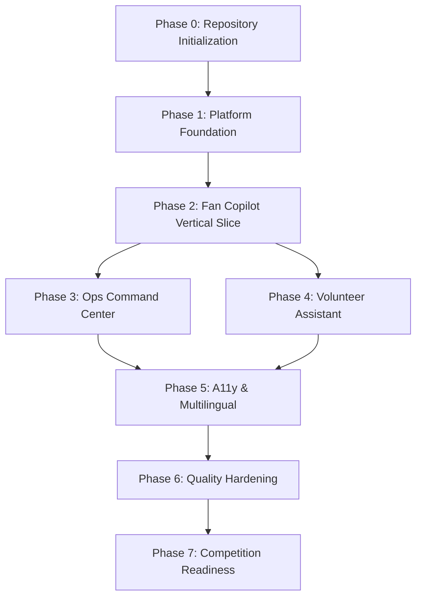

# FIFACoOS Implementation Plan

## 1. Document Information

**Document Name:** Master Implementation Plan
**Version:** 3.0.0
**Phase:** Engineering Roadmap
**Status:** Approved (Completed)
**Roles Assumed:** Technical Program Manager, Principal Software Architect, Engineering Manager, Staff Software Engineer, Release Manager, Technical Writer

## 2. Purpose

This Implementation Plan serves as the master execution blueprint for the FIFACoOS project. It translates the frozen Architecture v1.0 into an actionable, phased engineering strategy tailored to the PromptWars competition goals. It guides development from an empty repository through vertical slice integration to the final competition submission.

## 3. Relationship to Architecture Documents

The architectural design phase is completed and frozen as Architecture v1.0. This implementation plan strictly adheres to the following authoritative documents:

- `docs/product/PRD.md`
- `docs/architecture/ARCHITECTURE.md`
- `docs/architecture/SYSTEM_DESIGN.md`
- `docs/architecture/AI_ARCHITECTURE.md`
- `docs/architecture/DATABASE_SCHEMA.md`
- `docs/architecture/API_DESIGN.md`
- `docs/architecture/SECURITY.md`
- `docs/architecture/TESTING_STRATEGY.md`

## 4. Architecture Change Policy

If implementation requires changing any frozen architectural decision, implementation must pause until an Architecture Decision Record (ADR) is created, reviewed, and approved. Core architecture documents must not be modified directly after the Architecture Freeze.

## 5. Implementation Principles

- **Architecture First:** Adhere strictly to the frozen architecture. Deviations require an Architecture Decision Record (ADR).
- **Vertical Slice Development:** Deliver end-to-end user journeys (e.g., Fan asking for navigation) rather than isolated API or DB layers.
- **Documentation as Code:** Documentation (API specs, runbooks) evolves seamlessly alongside the implementation.
- **Security by Default:** Apply zero-trust patterns proactively. Ensure secure handling of operational access and PII data sanitization before LLM processing.
- **Accessibility by Design:** WCAG compliance, voice-ready architecture, and screen-reader optimizations are integrated from day one.
- **AI as Decision Support:** AI is the core engine for Fan Copilot and Ops Recommendations, treated as a mission-critical subsystem with strict fallbacks.
- **Incremental Delivery:** Small, verifiable PRs that continuously add measurable value.
- **Continuous Verification:** Every commit is validated by automated unit, integration, and accessibility tests.

## 6. Definition of Ready (DoR)

Before implementation begins on any feature or vertical slice, the following must be verified:

1. **Architecture Complete:** The feature aligns with the frozen architecture.
2. **Requirements Understood:** The user journey and edge cases are clearly defined in the PRD.
3. **Dependencies Resolved:** Upstream API endpoints, UI designs, or data models required for the slice are identified.
4. **Acceptance Criteria Defined:** Clear, testable objectives are established for the slice.
5. **Security Considerations Identified:** RBAC, data masking, and LLM prompt injection safeguards are specified.
6. **Testing Strategy Defined:** Test cases for unit, integration, and E2E validation are outlined.
7. **Documentation References Available:** Relevant sections in API_DESIGN.md or AI_ARCHITECTURE.md are referenced.

## 7. Definition of Done (DoD)

A feature is NOT complete until it satisfies the following:

1. **Architecture Compliance:** Fully aligns with frozen architecture documents.
2. **Business Logic Implemented:** Meets all acceptance criteria defined in the DoR/PRD.
3. **Security Requirements Met:** Passes static analysis; operational endpoints secured via RBAC; PII sanitized for LLMs.
4. **Accessibility Verified:** Automated accessibility validation passes; manual screen-reader flow verified.
5. **Tests Written:** Unit, Integration, and AI Prompt Evaluation tests written and passing. Coverage targets met.
6. **Documentation Updated:** API specs, component docs, and living documentation updated.
7. **Code Reviewed:** Approved by at least one peer (or AI Staff SWE equivalent).
8. **No Critical Defects:** Zero known P0/P1 issues.
9. **CI/CD Passed:** Builds successfully and deploys to the staging environment.

## 8. Overall Roadmap

## 9. Engineering Milestone Table

| Phase | Goal                      | Major Deliverables                                                   | Dependencies     | Exit Criteria                             | Estimated Effort |
| :---- | :------------------------ | :------------------------------------------------------------------- | :--------------- | :---------------------------------------- | :--------------- |
| **0** | Repository Initialization | CI/CD, Git hooks, Linter config                                      | None             | `main` branch protected, CI green         | Very Small       |
| **1** | Platform Foundation       | Shared UI, Routing, Base Layout, DB/Telemetry scaffolding            | Phase 0          | Shell app deployed, theme ready           | Small            |
| **2** | Fan Copilot Slice         | Anonymous fan flow, Smart Navigation, Wait times, AI retrieval       | Phase 1          | Fan asks "Where is Gate B?" & gets routed | Large            |
| **3** | Ops Command Center        | Authenticated Ops dashboard, Incident reporting, AI Decision Support | Phase 1, Phase 2 | Ops receives incident & AI recommendation | Large            |
| **4** | Volunteer Assistant       | Authenticated Volunteer view, FAQs, Policy retrieval                 | Phase 2, Phase 3 | Volunteer queries policy via AI           | Medium           |
| **5** | A11y & Multilingual       | Voice-ready UI, i18n, Screen reader optimization                     | Phase 4          | 100% WCAG automated score, translated UI  | Medium           |
| **6** | Quality Hardening         | Performance tuning, Sec review, AI accuracy evaluation               | Phase 5          | Zero P0/P1 bugs, Lighthouse > 90          | Large            |
| **7** | Competition Readiness     | Demo scripts, Demo environment, Submission assets                    | Phase 6          | End-to-end demo recorded & polished       | Small            |

---

## 10. Project Phases & Checklists

### Phase 0: Repository Initialization

- **Primary Architecture References:** `ARCHITECTURE.md`, `TESTING_STRATEGY.md`
- **Objective:** Establish the foundational version control, CI/CD pipelines, and initial project scaffolding.
- **Deliverables:** Git repository, CI/CD workflows, dependency management, linter/formatter rules.
- **Checklist:**
  - [x] Git repository structure created matching `SYSTEM_DESIGN.md`.
  - [x] CI/CD pipeline configured for linting and testing.
  - [x] Code formatting and linting rules enforced.
  - [x] Dependency package managers initialized.
  - [x] Phase approved.
- **Completion Evidence:**
  - CI/CD pipeline triggers automatically on PR creation.
  - Code passes all automated linting checks.
  - Main branch requires approved PRs for merge.

### Phase 1: Platform Foundation

- **Primary Architecture References:** `SYSTEM_DESIGN.md`, `API_DESIGN.md`, `DATABASE_SCHEMA.md`
- **Objective:** Scaffold the core frontend shell, routing, state management, and mock data adapters for the Unified Intelligence Engine.
- **Deliverables:** Shared UI Component library, Design System tokens, Base layouts, API client scaffolding.
- **Checklist:**
  - [x] Design system tokens (colors, typography, spacing) implemented.
  - [x] Shared accessible UI components (Buttons, Modals, Inputs) built.
  - [x] Core application routing and layout shell completed.
  - [x] Telemetry simulation adapters stubbed.
  - [x] Phase approved.
- **Completion Evidence:**
  - Shared UI components render correctly in isolation.
  - Application shell loads without console errors.
  - API client successfully connects to stubbed endpoints.

### Phase 2: Fan Copilot Vertical Slice

- **Primary Architecture References:** `PRD.md`, `AI_ARCHITECTURE.md`, `API_DESIGN.md`, `SECURITY.md`
- **Objective:** Deliver a complete, end-to-end journey for an anonymous fan requesting stadium assistance.
- **Deliverables:** Fan Copilot UI, Anonymous Session Management, Smart Navigation Service, POI Search, Wait Time Retrieval.
- **Checklist:**
  - [x] Anonymous fan session initialization.
  - [x] Conversational UI interface for Fan Copilot.
  - [x] Deterministic knowledge retrieval strategy integrated for stadium FAQs.
  - [x] Smart Navigation service integration (e.g., routing to gates/concessions).
  - [x] AI connected to process fan queries and return structured responses.
  - [x] Phase approved.
- **Completion Evidence:**
  - Anonymous session is created upon initial load.
  - Fan Copilot accurately responds to "Where is Gate B?" with navigational directions and wait times.
  - Deterministic knowledge retrieval returns stadium FAQs accurately.

### Phase 3: Operations Command Center Vertical Slice

- **Primary Architecture References:** `PRD.md`, `SYSTEM_DESIGN.md`, `DATABASE_SCHEMA.md`, `API_DESIGN.md`, `SECURITY.md`
- **Objective:** Deliver the operational dashboard where staff monitor telemetry and receive AI decision support for incidents.
- **Deliverables:** Authenticated Ops Login, Incident Dashboard, Telemetry Visualization, AI Recommendations Engine.
- **Checklist:**
  - [x] RBAC Authentication for Operations Role implemented.
  - [x] Real-time (or simulated) incident dashboard UI completed.
  - [x] Telemetry ingestion endpoint wired to dashboard.
  - [x] AI Decision Support integrated to recommend incident mitigations.
  - [x] Security validation on operational endpoints.
  - [x] Phase approved.
- **Completion Evidence:**
  - Operations personnel successfully log in with RBAC verification.
  - Incident dashboard visualizes telemetry data streams.
  - AI decision support generates actionable mitigation recommendations for simulated incidents.

### Phase 4: Volunteer Assistant Vertical Slice

- **Primary Architecture References:** `PRD.md`, `AI_ARCHITECTURE.md`, `SECURITY.md`
- **Objective:** Deliver a tailored AI assistant for stadium volunteers to access operational policies and FAQs.
- **Deliverables:** Authenticated Volunteer Login, Knowledge Access UI, Role-specific prompt templates.
- **Checklist:**
  - [x] RBAC Authentication for Volunteer Role implemented.
  - [x] Volunteer Copilot UI tailored for rapid information retrieval.
  - [x] AI connected to volunteer-specific policy knowledge base.
  - [x] Phase approved.
- **Completion Evidence:**
  - Volunteer successfully logs in with RBAC verification.
  - Volunteer Assistant successfully retrieves role-specific policies.

### Phase 5: Accessibility & Multilingual Experience

- **Primary Architecture References:** `PRD.md`
- **Objective:** Elevate the application to meet global inclusivity standards required for a FIFA-level event.
- **Deliverables:** i18n implementation, ARIA tag audit, Keyboard navigation flows, Voice-ready text processing.
- **Checklist:**
  - [x] Internationalization (i18n) framework integrated.
  - [x] Core application strings translated into at least two languages.
  - [x] Automated accessibility validation passed.
  - [x] Keyboard-only navigation verified for Copilots and Dashboard.
  - [x] Phase approved.
- **Completion Evidence:**
  - Automated accessibility validation scores 100% against WCAG guidelines.
  - Application fully operable via keyboard navigation.
  - UI switches seamlessly between two translated languages.

### Phase 6: Quality Hardening

- **Primary Architecture References:** `SECURITY.md`, `TESTING_STRATEGY.md`, `AI_ARCHITECTURE.md`
- **Objective:** Stabilize, optimize, and secure the application for final delivery.
- **Deliverables:** Performance optimization, dependency updates, security patching, comprehensive E2E tests, AI evaluation.
- **Checklist:**
  - [x] End-to-end regression tests executed and passing.
  - [x] Lighthouse performance scores verified (>90).
  - [x] AI response guardrails and latency bounds validated.
  - [x] PII sanitization verified on Copilot inputs.
  - [x] Phase approved.
- **Completion Evidence:**
  - End-to-end test suites execute with 100% pass rate.
  - Performance audits confirm >90 scores.
  - Security scans report zero critical or high vulnerabilities.
  - AI evaluation confirms accurate outputs and sanitized PII handling.

### Phase 7: Competition Readiness

- **Primary Architecture References:** `PRD.md`, `ARCHITECTURE.md`
- **Objective:** Package the application and demonstrations for the PromptWars competition.
- **Deliverables:** Submission assets, final demo environment, demonstration scripts.
- **Checklist:**
  - [x] Demo environment seeded with simulation data.
  - [x] Walkthrough scripts for all primary personas written.
  - [x] Final submission documentation and videos generated.
  - [x] Phase approved.
- **Completion Evidence:**
  - End-to-end competition demo scenario is successfully completed.
  - Demo environment is fully provisioned and stable.
  - Submission assets (videos, documentation) are finalized and verified.

---

## 11. Feature Implementation Order

1. **Foundation & Shared UI:** Required to build any user interface quickly and consistently.
2. **Fan Copilot (Anonymous Flow):** Highest visibility feature. Proves the AI integration, knowledge retrieval, and UI conversational mechanics without being blocked by complex auth.
3. **Authentication (RBAC):** Prerequisites for Operations and Volunteer roles. Implementing this _after_ the anonymous fan flow ensures we don't block the highest priority user journey.
4. **Operations Command Center:** Builds upon the core UI and AI services, adding complexity via telemetry, incident tracking, and RBAC.
5. **Volunteer Assistant:** A straightforward extension of the Fan Copilot and Auth systems.
6. **Accessibility & i18n:** Best applied holistically once the core DOM structure and components are stable.

---

## 12. Competition Submissions (PromptWars)

- **Submission 1: The Fan Experience**
  - _Objectives:_ Demonstrate the core AI capability and conversational UI.
  - _Features Completed:_ Anonymous Fan flow, Fan Copilot, Knowledge Retrieval.
  - _Demo Scenario:_ Fan asks, "Where is Gate B?" and receives accessibility-aware routing and current wait-time information.
  - _Success Criteria:_ AI returns accurate, context-aware navigational data in under 2 seconds.

- **Submission 2: The Command Center**
  - _Objectives:_ Showcase the Unified Intelligence Engine handling operational data.
  - _Features Completed:_ Ops Authentication, Incident Dashboard, AI Decision Support, Telemetry Simulation.
  - _Demo Scenario:_ A simulated crowd crush incident at Gate B triggers an alert. The Operations dashboard displays the incident, and the AI recommends redirecting fans to Gate C.
  - _Success Criteria:_ Real-time data visualization combined with logical, actionable AI recommendations.

- **Submission 3: The Complete FIFACoOS Experience**
  - _Objectives:_ Deliver the final, hardened, accessible, and multilingual product.
  - _Features Completed:_ Volunteer Assistant, full i18n, WCAG compliance, Performance optimization.
  - _Demo Scenario:_ End-to-end journey touching all three personas (Fan, Ops, Volunteer), switching languages seamlessly, and navigating via keyboard/screen reader.
  - _Success Criteria:_ A flawless, premium demonstration that highlights the architecture's resilience and inclusivity.

---

## 13. Git Workflow & Commit Strategy

- **Branching Strategy:** Trunk-based development with short-lived feature branches (`feature/fan-copilot`, `fix/incident-dashboard`).
- **Commit Philosophy:** Conventional Commits (`feat: add smart navigation service`, `fix: sanitize PII in copilot input`).
- **Pull Request Philosophy:** Small, atomic PRs linked to specific Vertical Slices.
- **Merge Strategy:** Squash and merge to `main`.
- **Version Tagging:** Semantic Versioning (`vMAJOR.MINOR.PATCH`).

---

## 14. Documentation Strategy

- **Frozen Documents (Change strictly via Architecture Decision Records):**
  - `PRD.md`, `ARCHITECTURE.md`, `SYSTEM_DESIGN.md`, `DATABASE_SCHEMA.md`, `AI_ARCHITECTURE.md`, `SECURITY.md`, `TESTING_STRATEGY.md`.
- **Living Documents (Evolve continuously during implementation):**
  - `README.md`, Developer Guide, `IMPLEMENTATION_PLAN.md` (checklists updated), `API_DESIGN.md` (as endpoints materialize), Change Log, Deployment Guide, Runbooks, Testing Reports.

---

## 15. Testing Strategy Integration

- **Phase 1-2:** Focus on UI component unit tests, and prompt evaluation tests for the Fan Copilot.
- **Phase 3-4:** Integration tests for RBAC, API endpoint security tests, and mock telemetry ingestion tests.
- **Phase 5:** Automated accessibility validation suites and visual regression testing for i18n layouts.
- **Phase 6:** Full end-to-end regression testing framework simulating complete competition demo flows.

---

## 16. Risk Management

| Risk                                | Mitigation Strategy                                                                                                                  |
| :---------------------------------- | :----------------------------------------------------------------------------------------------------------------------------------- |
| **AI Hallucinations in Navigation** | Use strictly grounded deterministic knowledge retrieval strategy and hardcoded map coordinates for fallback.                         |
| **Telemetry Simulation Complexity** | Stub telemetry with static JSON payloads initially. Only build complex event generators if time permits in Phase 6.                  |
| **Accessibility Retrofitting**      | Enforce automated accessibility validation in Phase 1 Shared UI components. Do not wait until Phase 5 to fix fundamental DOM issues. |
| **Scope Creep in Dashboard**        | Limit Ops dashboard to 2 specific incident types (e.g., Crowd Density, Medical). Reject generic metrics.                             |
| **LLM Latency**                     | Implement responsive AI interaction patterns in the Copilot UI to improve perceived performance.                                     |

---

## 17. Quality Gates

Mandatory gates before progressing to the next phase:

1. **Build Gate:** `main` branch builds successfully without warnings.
2. **Architecture Gate:** Implementation strictly aligns with `SYSTEM_DESIGN.md` and `AI_ARCHITECTURE.md`.
3. **Test Gate:** Target test coverage achieved in CI. AI Evaluation passes baseline accuracy.
4. **Documentation Gate:** All living documents (API specs, runbooks) are current.
5. **Security Gate:** SAST reports zero critical/high vulnerabilities. PII stripping confirmed.

---

## 18. Technology Decision Resolution

The technology selections for FIFACoOS are resolved as follows (detailed in `TECHNOLOGY_DECISIONS.md`):

- **Frontend Framework**: Next.js 16 (App Router) for Server-First modular pages and Client components.
- **Backend Framework**: Next.js Server Components, Route Handlers, and Server Actions for secure, typed data orchestration.
- **Auth Provider**: Supabase Auth (GoTrue) for RBAC, Operations/Volunteer sessions, and Anonymous Fan interfaces.
- **Database Platform**: Supabase PostgreSQL with Row-Level Security (RLS) for data isolation.
- **LLM Provider**: Google Gemini via Vercel AI SDK acting as the provider-agnostic gateway.
- **Knowledge Retrieval Strategy**: Deterministic exact-match database queries fetching structured standard operating procedures and FAQs to prevent hallucination.
- **Maps Provider**: Mapbox GL JS for accessible, visually-customizable stadium wayfinding maps.
- **Telemetry Simulation Strategy**: A dedicated scheduled in-application simulation engine that updates zone crowd densities and incident states in the database.
- **i18n Library**: `next-intl` supporting English (EN), Spanish (ES), French (FR), and Hindi (HI).
- **Accessibility (A11y)**: Radix UI headless primitives (via shadcn/ui) verified with `eslint-plugin-jsx-a11y` static checks and automated axe-core scans.
- **State Management**: React Server Components (RSC) for server-side state with Zustand for complex client-side chat and dashboard interaction.
- **Deployment Platform**: Vercel for serverless edge deployment.
- **Observability Platform**: Pino structured JSON logs for backend logging.
- **Testing Framework**: Vitest for unit and integration testing, and Playwright for cross-browser E2E testing.

---

## 19. Executive Summary

**Overall Implementation Philosophy:**
The FIFACoOS implementation favors working vertical slices over isolated infrastructure layers. We prioritize the Fan, Operations, and Volunteer experiences, ensuring that every engineering phase delivers tangible, competition-ready value aligned perfectly with the frozen Architecture v1.0.

**Major Milestones:**

1. Platform Foundation (Phase 1)
2. Fan Copilot Vertical Slice (Phase 2)
3. Operations Command Center (Phase 3)
4. Volunteer Assistant (Phase 4)
5. Competition Readiness & Demo (Phase 7)

**Critical Path:**
Foundation -> Fan Copilot -> Ops Authentication -> Incident Management -> Quality Hardening.

**Highest Implementation Risks:**

1. Unpredictable LLM outputs misguiding fans (mitigated by strict deterministic retrieval grounding).
2. Over-engineering the telemetry simulation (mitigated by starting with static mocks).

**Expected Engineering Workflow:**
Trunk-based development with short-lived feature branches, atomic commits, and rigorous Quality Gates enforcing the Definition of Done.

**Frozen Documents (Do NOT Modify):**
`PRD.md`, `ARCHITECTURE.md`, `SYSTEM_DESIGN.md`, `DATABASE_SCHEMA.md`, `AI_ARCHITECTURE.md`, `SECURITY.md`, `TESTING_STRATEGY.md`.

**Evolving Living Documents:**
`README.md`, `IMPLEMENTATION_PLAN.md`, `API_DESIGN.md`, Developer Guides, and Test Reports.
