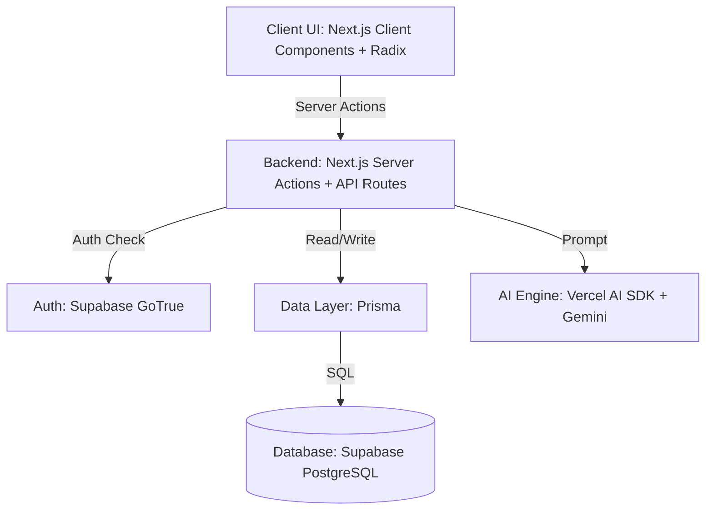

# FIFACoOS - Technology Decisions

## 1. Document Information
- **Version:** 1.0
- **Status:** Approved
- **Author:** Principal Architecture Review Board
- **Last Updated:** Architecture Synchronization Review
- **Depends On:** `ARCHITECTURE.md`, `SYSTEM_DESIGN.md`, `AI_ARCHITECTURE.md`

## 2. Purpose
This document serves as the authoritative record of all major technology choices for the FIFACoOS project. It bridges the abstract, frozen architecture with the concrete implementation roadmap. Future Architecture Decision Records (ADRs) will derive their context and baseline from this document.

## 3. Relationship to Architecture
Every decision explicitly references and supports the frozen architecture. The stack reflects the server-first, modular monolith pattern, the deterministic handling of AI reasoning, strict security boundaries via Row-Level Security, and the constraints of a single-developer MVP built for the PromptWars competition.

## 4. Decision-Making Principles
- **Developer Productivity (Solo Dev):** High leverage, unified ecosystems, and minimal boilerplate to guarantee MVP delivery.
- **Architecture Before Convenience:** Selections must enforce the deterministic boundaries and layered architecture defined in `ARCHITECTURE.md`.
- **Security by Default:** Technologies must natively support robust authentication, data masking, and authorization down to the database row level.
- **AI-First, Provider Agnostic:** AI abstractions must prevent vendor lock-in while enforcing strict input/output validation.
- **Performance & Accessibility:** UI frameworks must prioritize Web Content Accessibility Guidelines (WCAG) compliance and fast time-to-interactive.

---

## 5. Technology Decisions

### 5.1 Frontend & Backend Framework
- **Decision:** Next.js (App Router)
- **Status:** Approved
- **Problem Statement:** The architecture requires a server-first, modular monolith supporting both highly dynamic conversational UIs (CSR) and deterministic, SEO-friendly static rendering (SSR) while keeping the API layer closely coupled but logically separated.
- **Alternatives Considered:** React SPA + Express.js backend; SvelteKit; Remix.
- **Chosen Solution:** Next.js 14+ utilizing the App Router.
- **Why It Was Chosen:** Next.js perfectly aligns with the "Server-first, modular monolith" constraint in `ARCHITECTURE.md`. Server Components (RSC) enforce deterministic, secure data fetching, while Client Components manage the conversational UI state. It provides the highest productivity for a solo developer.
- **Advantages:** Unified routing, zero-API data fetching via Server Actions, robust ecosystem.
- **Trade-offs:** Steeper learning curve for RSC caching boundaries; vendor tie-in to Vercel ecosystem.
- **Future Reconsideration Criteria:** If the domain logic requires decoupling into independent microservices, the backend logic will be migrated out of Next.js API routes.
- **Architecture References:** `SYSTEM_DESIGN.md` (Modular Monolith), `ARCHITECTURE.md` (Server-First).
- **Implementation Notes:** All Fan UI will default to Server Components unless interactivity (like the Copilot chat) strictly requires `"use client"`.

### 5.2 Programming Language
- **Decision:** TypeScript
- **Status:** Approved
- **Problem Statement:** The system requires strict domain modeling and validation, specifically ensuring AI outputs match expected schemas.
- **Alternatives Considered:** JavaScript, Python, Go.
- **Chosen Solution:** Strict TypeScript end-to-end.
- **Why It Was Chosen:** Shares the same language across frontend and backend in Next.js. Integrates flawlessly with Zod for AI validation.
- **Advantages:** End-to-end type safety, massive ecosystem, catches errors at compile time.
- **Trade-offs:** Build step required, type gymnastics can sometimes slow down rapid prototyping.
- **Future Reconsideration Criteria:** None. TypeScript is a permanent choice for this stack.
- **Architecture References:** `API_DESIGN.md` (Contracts), `AI_ARCHITECTURE.md` (Schema Validation).
- **Implementation Notes:** Enforce `strict: true` in `tsconfig.json`.

### 5.3 UI Component Strategy
- **Decision:** Radix UI (Headless Primitives)
- **Status:** Approved
- **Problem Statement:** The UI must be highly accessible (WCAG compliant) by design (`PRD.md`) while supporting a custom, premium FIFA-tier design aesthetic.
- **Alternatives Considered:** Material UI, Chakra UI, building from scratch.
- **Chosen Solution:** Radix UI primitives.
- **Why It Was Chosen:** Radix provides the complex ARIA attributes, keyboard navigation, and focus management required by the architecture without enforcing any specific visual styling, leaving room for custom aesthetics.
- **Advantages:** Perfect accessibility out-of-the-box, completely unstyled.
- **Trade-offs:** Requires writing custom CSS for every component state.
- **Future Reconsideration Criteria:** If UI development is too slow, a styled library like shadcn/ui (which wraps Radix) may be evaluated.
- **Architecture References:** `ARCHITECTURE.md` (Accessibility Considerations).
- **Implementation Notes:** Wrappers will be created for Dialogs, Dropdowns, and Accordions.

### 5.4 Styling System
- **Decision:** Vanilla CSS (CSS Modules)
- **Status:** Approved
- **Problem Statement:** We need scoped, maintainable CSS to achieve a premium design without the clutter of utility classes, adhering to maximum flexibility and control as mandated by web development guidelines.
- **Alternatives Considered:** Tailwind CSS, Styled Components, Emotion.
- **Chosen Solution:** Vanilla CSS via Next.js CSS Modules (`.module.css`).
- **Why It Was Chosen:** Aligns with the project's web development directives to avoid Tailwind CSS unless explicitly requested. CSS Modules provide localized scoping, preventing global conflicts, while allowing standard CSS syntax.
- **Advantages:** No learning curve for standard CSS, zero runtime overhead, native browser features (CSS variables).
- **Trade-offs:** Requires manual file management for styles; slightly slower velocity compared to utility-first frameworks.
- **Future Reconsideration Criteria:** If the styling becomes difficult to scale, a unified design token system or Tailwind might be formally requested.
- **Architecture References:** `ARCHITECTURE.md` (UI Layer).
- **Implementation Notes:** Utilize CSS variables (`var(--color-primary)`) at the `:root` level for design tokens and dark mode support.

### 5.5 Authentication Platform & Database Platform
- **Decision:** Supabase (Auth + PostgreSQL)
- **Status:** Approved
- **Problem Statement:** The application requires strict RBAC (Fans, Volunteers, Ops) and Row-Level Security to segregate sensitive telemetry data from anonymous fans.
- **Alternatives Considered:** NextAuth + PlanetScale, Firebase.
- **Chosen Solution:** Supabase (combining GoTrue Auth and managed PostgreSQL).
- **Why It Was Chosen:** Supabase maps authentication directly to the Postgres database. This enables Row-Level Security (RLS), perfectly satisfying the `SECURITY.md` requirement that anonymous sessions cannot query operational data, enforced at the lowest possible database level.
- **Advantages:** Unbeatable security via RLS, relational integrity, unified platform.
- **Trade-offs:** Tightly couples Auth to the Database layer.
- **Future Reconsideration Criteria:** If migrating off Postgres, Auth would need to be rewritten to a provider like Clerk or Auth0.
- **Architecture References:** `DATABASE_SCHEMA.md`, `SECURITY.md` (RBAC, Data Segregation).
- **Implementation Notes:** RLS policies must be written and tested as the primary security barrier.

### 5.6 ORM / Query Layer
- **Decision:** Prisma ORM
- **Status:** Approved
- **Problem Statement:** The application needs a productive way to interact with PostgreSQL while maintaining TypeScript type safety and supporting complex JSON fields for AI metadata.
- **Alternatives Considered:** Drizzle ORM, TypeORM, raw SQL (pg).
- **Chosen Solution:** Prisma ORM.
- **Why It Was Chosen:** Prisma's schema definition provides an excellent single source of truth that maps perfectly to `DATABASE_SCHEMA.md`. Its developer experience is unmatched for a solo developer optimizing for speed to MVP.
- **Advantages:** Auto-generated types, excellent migrations, highly readable schema file.
- **Trade-offs:** Heavier runtime bundle; cold start penalties in serverless environments (mitigated by Prisma Accelerate or Edge deployment strategies).
- **Future Reconsideration Criteria:** If serverless cold starts become a critical bottleneck, Drizzle ORM will be evaluated.
- **Architecture References:** `DATABASE_SCHEMA.md`.
- **Implementation Notes:** Prisma schema will be the physical manifestation of the Domain Model.

### 5.7 AI Provider & Orchestration
- **Decision:** Google Gemini via Vercel AI SDK
- **Status:** Approved
- **Problem Statement:** The AI reasoning pipeline must process natural language, summarize unstructured reports, and return strictly typed JSON while avoiding hard vendor lock-in to a single LLM API.
- **Alternatives Considered:** OpenAI API directly, LangChain.
- **Chosen Solution:** Vercel AI SDK acting as the `AIGateway`, utilizing Google Gemini (Pro/Flash) as the primary model.
- **Why It Was Chosen:** Vercel AI SDK provides the `AIGateway` abstraction required by `ARCHITECTURE.md`, allowing models to be swapped with a single line of code. Gemini is chosen as the underlying engine for its large context window and strong JSON generation capabilities, fitting the PromptWars ecosystem.
- **Advantages:** Provider agnostic, built-in streaming hooks for React, native Zod integration for structured output.
- **Trade-offs:** Vercel AI SDK abstractions can sometimes hide underlying provider features.
- **Future Reconsideration Criteria:** Model swaps will be evaluated based on latency and validation failure rates.
- **Architecture References:** `AI_ARCHITECTURE.md` (Provider Agnostic, Streaming).
- **Implementation Notes:** Use `streamObject` for UI generation and `generateObject` for backend decision support.

### 5.8 Validation Strategy
- **Decision:** Zod
- **Status:** Approved
- **Problem Statement:** The system must deterministically validate all user inputs and, critically, validate all LLM outputs before they reach the UI or database.
- **Alternatives Considered:** Yup, Joi, JSON Schema.
- **Chosen Solution:** Zod.
- **Why It Was Chosen:** It is the industry standard for TypeScript schema validation and integrates natively with the Vercel AI SDK for structured LLM outputs.
- **Advantages:** Prevents LLM hallucinations from breaking the UI; provides type inference (`z.infer`).
- **Trade-offs:** Slight runtime parsing overhead.
- **Future Reconsideration Criteria:** None.
- **Architecture References:** `AI_ARCHITECTURE.md` (Response Validation), `API_DESIGN.md`.
- **Implementation Notes:** AI fallback triggers automatically if Zod parsing fails on LLM output.

### 5.9 Knowledge Retrieval Strategy
- **Decision:** Deterministic Exact-Match / Pre-computed DB Queries
- **Status:** Approved
- **Problem Statement:** The AI must have access to stadium policies and wayfinding rules without hallucinating. The MVP constraints explicitly limit complex event-driven architectures.
- **Alternatives Considered:** Full RAG pipeline with vector databases (Pinecone, pgvector).
- **Chosen Solution:** Deterministic retrieval from standard PostgreSQL tables based on user role and context, injected directly into the prompt.
- **Why It Was Chosen:** For the MVP, a complex RAG pipeline introduces unnecessary latency and failure points. Fetching predefined FAQs and routing rules deterministically based on the user's location and role is safer and perfectly aligns with the "Deterministic First" principle.
- **Advantages:** 100% deterministic, zero hallucination risk on context retrieval, fast.
- **Trade-offs:** Lacks semantic search capabilities for highly obscure questions.
- **Future Reconsideration Criteria:** Post-MVP, migrate to pgvector for semantic RAG if deterministic rules become too large for the context window.
- **Architecture References:** `AI_ARCHITECTURE.md` (Context Gathering).
- **Implementation Notes:** Knowledge context is fetched in Server Actions before invoking the LLM.

### 5.10 Telemetry Simulation Strategy
- **Decision:** Next.js API Routes + Vercel Cron
- **Status:** Approved
- **Problem Statement:** The Ops dashboard needs realistic crowd density and incident data, but connecting to real IoT sensors is out of scope for the MVP.
- **Alternatives Considered:** Custom Node.js interval scripts, external mocking services (Mockaroo).
- **Chosen Solution:** Dedicated Next.js API endpoints triggered by Vercel Cron jobs.
- **Why It Was Chosen:** Keeps the simulation logic co-located in the monolith but isolated in execution. Vercel Cron handles the timing without requiring a separate long-running worker dyno.
- **Advantages:** Zero infrastructure overhead, easily modifiable in TypeScript.
- **Trade-offs:** 1-minute minimum resolution on cron jobs may feel less "real-time" than websockets, but is acceptable for MVP polling.
- **Future Reconsideration Criteria:** Replace with real Webhook ingestion endpoints when hardware is available.
- **Architecture References:** `ARCHITECTURE.md` (Simulated Telemetry Engine).

### 5.11 State Management & API Communication
- **Decision:** React Server Components + Zustand + Server Actions
- **Status:** Approved
- **Problem Statement:** Need to manage chat history for fans, real-time telemetry for Ops, and standard form submissions securely.
- **Chosen Solution:** 
  - **Data Fetching:** React Server Components (RSC) for initial loads.
  - **Mutations:** Next.js Server Actions (RPC style).
  - **Client State:** Zustand for complex client-side state (like map layers or active chat threads).
- **Why It Was Chosen:** Eliminates the need for a separate Redux store and traditional REST `fetch` boilerplate. Server Actions provide secure, typed mutations.
- **Architecture References:** `SYSTEM_DESIGN.md` (Application Layer).

### 5.12 Tooling & Operations
- **Maps Provider:** Mapbox GL JS (Accessible, visually customizable for stadium layouts).
- **Internationalization:** `next-intl` (App Router compatible, integrates well with Server Components).
- **Accessibility Tooling:** `eslint-plugin-jsx-a11y` and `@axe-core/react` for runtime warnings.
- **Testing Framework:** Vitest (Unit tests for pure domain logic) + Playwright (E2E flows and visual accessibility checks).
- **Package Manager:** pnpm (Speed and strict dependency resolution).
- **Code Formatting / Linting:** Prettier + ESLint.
- **Environment Configuration:** `t3-env` (Enforces Zod validation on `.env` variables at build time).
- **Deployment Platform:** Vercel (Native optimization for Next.js).
- **CI/CD Platform:** GitHub Actions.
- **Observability & Logging:** Sentry for error tracking; Pino for structured JSON server logging; Vercel Analytics for web vitals.
- **Secrets Management:** Vercel Environment Variables.
- **Documentation Generation:** TypeDoc + standard Markdown for living documentation.

---

## 6. Special AI Section
The AI architecture relies entirely on the **Vercel AI SDK** to provide the `AIGateway`. 
- **LLM Selection:** Google Gemini is utilized for its strong JSON adherence.
- **Structured Outputs:** Every AI invocation uses the `generateObject` or `streamObject` methods paired with a Zod schema. If the model hallucinates an invalid structure, Zod throws an error, which the backend catches, triggering a safe deterministic fallback message to the UI.
- **Guardrails:** PII stripping and prompt injection sanitization occur in the Next.js Server Action *before* the Vercel AI SDK is invoked.
- **Future RAG Evolution:** Currently, context is retrieved deterministically (e.g., `SELECT * FROM policies WHERE role = 'volunteer'`). Post-MVP, this will evolve to `pgvector` semantic search within Supabase.

## 7. Database Section
- **Why Relational:** Strict ACID compliance is mandatory for incident management and assignments.
- **Why Row-Level Security (RLS):** RLS ensures that even if an API endpoint has a vulnerability, the database itself will reject queries for operational data originating from an anonymous fan session.
- **Why Structured Schema:** Prisma enforces the Domain Model at compile time, eliminating a massive class of runtime errors.
- **Telemetry Storage:** Telemetry is stored as append-only records utilizing Postgres `JSONB` columns to allow flexible sensor payloads without constant schema migrations.

## 8. Frontend & Backend Section
- **Server Components (RSC):** Used heavily for rendering static stadium data and layouts. This shifts the computational burden away from the user's mobile device, improving battery life and performance.
- **Client Components:** Reserved strictly for the Fan Copilot chat interface and interactive mapping.
- **Server Actions:** Act as the Boundary layer. All form submissions and AI requests go through Server Actions, which validate inputs (Zod) and enforce RBAC before proceeding to the domain layer.

## 9. Security Section
- **Least Privilege:** Supabase RLS enforces least privilege at the disk level.
- **RBAC:** Managed via Supabase Auth custom claims, mapped to the `user_role` enum.
- **Data Privacy:** Server Actions intercept fan queries and strip potential PII using regex/heuristics before constructing the LLM prompt.

---

## 10. Trade-Off Matrix

| Decision | Chosen | Alternative | Reason | Trade-offs |
| :--- | :--- | :--- | :--- | :--- |
| **Framework** | Next.js (App Router) | React SPA + Express | Unified routing and data fetching. | Vendor lock-in; RSC learning curve. |
| **Database** | Supabase (Postgres) | MongoDB / Firebase | Relational integrity + native RLS for security. | Schema migrations require more planning. |
| **Styling** | Vanilla CSS Modules | Tailwind CSS | Alignment with design principles for maximum control and avoiding utility clutter. | Slower to author; manual file scoping. |
| **AI Integration** | Vercel AI SDK | Direct API calls | Provider agnostic; native React streaming. | Abstraction hides some provider-specific tools. |
| **Knowledge Retrieval** | Deterministic DB Query | Vector DB (RAG) | Ensures zero hallucination for MVP phase. | Cannot answer highly obscure semantic queries. |

---

## 11. Risk Analysis

| Technology Risk | Mitigation | Migration Path |
| :--- | :--- | :--- |
| **Next.js App Router Instability** | Stick to stable, documented patterns. Avoid experimental features. | Revert complex RSCs to Client Components. |
| **Prisma Cold Starts** | Deploy Database on same region as Vercel functions; use connection pooling (Supavisor). | Migrate to Drizzle ORM if latency is unacceptable. |
| **AI Model Deprecation** | Vercel AI SDK abstraction layer. | Swap the `model` string from Gemini to OpenAI in one line. |
| **Supabase Lock-in** | Keep Prisma schema provider-agnostic where possible. | Standard Postgres export; rewrite Auth to NextAuth. |

---

## 12. Implementation Order

To ensure a smooth vertical slice rollout, technologies must be configured in this strict sequence:

1. **Language & Environment:** TypeScript + pnpm + ESLint/Prettier. (Foundation)
2. **Framework:** Next.js scaffolding. (Provides the shell)
3. **Database & ORM:** Supabase + Prisma schema migration. (Defines the reality)
4. **Authentication:** Supabase Auth + RLS policies. (Secures the reality)
5. **UI & Styling:** Radix + CSS Modules. (Visualizes the reality)
6. **AI Provider:** Vercel AI SDK integration. (Adds intelligence)
7. **Deployment & Observability:** Vercel + Sentry. (Prepares for production)

*Reasoning:* You cannot build the UI without knowing the data shape (Prisma). You cannot secure the API without Auth. You cannot build the AI without the secured data context.

---

## 13. Future ADR Mapping

As the implementation progresses, architectural deviations or deeper technical implementations of these choices will be documented in the following structure:

- **ADR-001** -> Next.js App Router Architecture & Caching Strategy
- **ADR-002** -> Supabase Row-Level Security Policy Design
- **ADR-003** -> Radix UI Accessibility Wrapper Patterns
- **ADR-004** -> Deterministic AI Context Retrieval Implementation
- **ADR-005** -> Vercel Cron Telemetry Simulation Setup

---

## 14. Diagrams

### Technology Stack Overview

---

## 15. Executive Summary
**Technology Philosophy:** The technology stack for FIFACoOS prioritizes developer velocity, strict typing, and built-in security, leveraging the Next.js and Supabase ecosystems to allow a single developer to build a robust, FIFA-scale architecture.

**Major Decisions:** Next.js (App Router) serves as the unified application framework. Supabase provides the crucial Row-Level Security and relational data integrity. The Vercel AI SDK acts as a vendor-agnostic gateway to Google Gemini, strictly enforcing structured outputs via Zod.

**Highest-Risk Decisions:** Relying heavily on React Server Components introduces complexity in state management and caching, which must be carefully monitored. The decision to use Vanilla CSS Modules over utility frameworks sacrifices some speed for total aesthetic control.

**Migration Flexibility:** The architecture is highly defensive. By using Prisma, the database provider can be swapped. By using Vercel AI SDK, the LLM can be swapped.

**Readiness:** The technology stack is finalized, fully supports the frozen architecture, adheres strictly to all security and AI constraints, and is ready for Phase 0 implementation.
